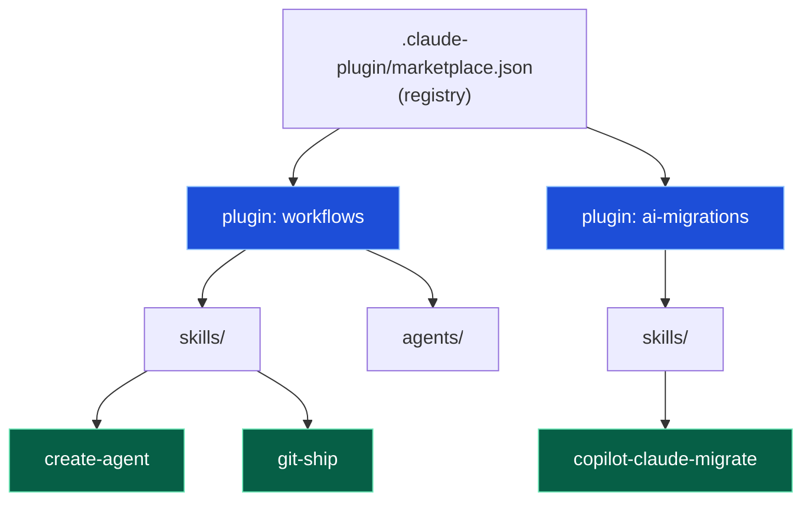
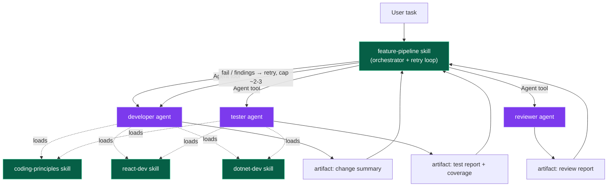

# Architecture

How this marketplace is wired, and the proposed **developer pipeline** — a
`developer` → `tester` → `reviewer` flow that specializes per stack via skills.

---

## 1. Marketplace → plugins → skills/agents



Each plugin: a `.claude-plugin/plugin.json` manifest + `skills/` + optional `agents/`.
Adding a skill to an existing plugin needs **no** marketplace edit.

---

## 2. Skill vs Agent — the mental model

| | Skill | Agent |
|---|---|---|
| What | Reusable instructions / knowledge pack | Autonomous subagent |
| Trigger | `description` auto-match, `Skill` tool, or `/name` | `Agent` tool dispatch |
| Context | Runs in current thread | Own isolated context |
| Owns | A workflow or knowledge pack | A multi-step task, start to finish |
| Can load skills? | — | Yes (with `Skill` in `tools`) |
| Can spawn subagents? | via main thread | **No** — a subagent can't spawn another |

Two load-bearing facts drive the whole design:

1. **An agent can load skills** → that is how one agent specializes per stack.
2. **A subagent can't spawn a subagent** → orchestration must live one level up
   (main thread or a top-level orchestrator skill), never inside `developer`.

---

## 3. Real skills vs plain knowledge files

Stack knowledge (React, .NET) is shipped as **real skills**, not plain files the
agent reads. The deciding factor is reuse:

| | Real skill (`SKILL.md`) | Plain file (`references/x.md` read directly) |
|---|---|---|
| Auto-triggers globally | Yes | No |
| Usable in main thread (no agent) | Yes | No |
| Usable by other agents/skills | Yes | Only if they know its path |
| Independently eval'd | Yes (repo pattern) | No |
| Ships in `/plugin install` | Yes | No |
| Setup cost | Tune `description`, add evals | Just write a file |

Plain files are **locked to whatever knows their path**. Real skills are reusable
everywhere — and this repo *is* a skill marketplace, so stack knowledge as skills
is the product.

**Hybrid shape used here:** a thin `SKILL.md` (triggers + index) that points to
`references/*.md` for depth. Auto-triggers *and* keeps context small.

```
skills/react-dev/
  SKILL.md            ← thin: triggers, "for testing see references/testing.md"
  references/
    components.md
    testing.md        ← Jest / React Testing Library conventions
```

---

## 4. The developer pipeline

Three agents, one orchestrator, shared stack skills. Universal principles sit
above every stack; stack skills hold stack-specific knowledge (including how to
test that stack).



### Flow

```
feature-pipeline (orchestrator — main thread or skill)
│
├─► developer agent  ──► { files changed, stack, verify result }
│                             │  output becomes next input
├─► tester agent     ──► writes + runs tests ──► { pass/fail, coverage }
│                             │
├─► reviewer agent   ──► { verdict, findings }  (own rubric + report artifact)
│
└─► if fail / findings → loop back to developer (cap ~2-3 iterations)
```

The **orchestrator owns the loop** — retry-on-failure, gates, iteration cap.
No single agent decides to re-run another; a subagent can't spawn subagents.

The orchestrator also owns two mechanical handoffs agents can't do themselves:

- **Diff for the reviewer** — the reviewer has no `Bash`, so it can't run
  `git diff`. The orchestrator computes the diff (e.g. `git diff` over the files
  the developer + tester touched) and passes it in the reviewer's input.
- **Retry context** — each `Agent` dispatch is a fresh context. On loop-back the
  orchestrator must pass the previous attempt's summary + failures back to the
  developer (see the re-entry contract in §8), or iteration 2 starts blind.

---

## 5. Routing — how a stack gets picked

Two layers, working together:

1. **Skill descriptions** — `react-dev` says "use for React/TypeScript tasks",
   `dotnet-dev` says "use for .NET/C# tasks". They auto-match on their own.
2. **Agent prompt** — `developer`/`tester` inspect the task + repo signals
   (`package.json` vs `.csproj`) and load the matching skill(s) via the `Skill` tool.

**Load the relevant *set*, not one branch.** A full-stack task (React front +
.NET back) loads *both* skills and the agent implements/tests both. Routing itself
is a cheap glob check — the agent's real value is the implementation, not routing.

Adding a new stack later = **one new skill + one routing line**. No agent rewrite.

---

## 6. Universal rules — one place

Cross-cutting principles (DRY, KISS, YAGNI, naming, error handling) apply to every
stack, so they live **above** the stack skills as a `coding-principles` skill —
reusable even when working without the pipeline. Stack skills stay stack-specific.

---

## 7. Testing — one tester, stack-aware

Test tooling is stack-specific, so the tester uses the **same router pattern** as
the developer. It does **not** hardcode frameworks — it reads them from the stack
skill's `references/testing.md`.

```
React  → Jest + React Testing Library, render/user-event, mock fetch, *.test.tsx
.NET   → xUnit / NUnit, Arrange-Act-Assert, Moq, dotnet test, *Tests.cs
```

Why testing lives *inside* the stack skill (not a separate testing skill):

- **Cohesion** — "how to test React" *is* React knowledge.
- **No drift** — developer and tester load the *same* skill, so a component and
  its test share conventions.
- **DRY** — one place per stack; add a stack = add its `testing.md`, no tester rewrite.

**One tester agent, N stacks** — full-stack task loads both skills, writes both
suites. Splitting into frontend-tester / backend-tester would duplicate router
logic and break DRY.

---

## 8. Handoff contracts (the wire format)

Agents receive a **prompt string**, not a typed object. A JSON-shaped task is a
*convention* the agent is told to parse — no type safety, but structured. JSON
input is worth it for orchestrated/unattended handoff; free text is fine interactively.

**Input** to `developer`:

```json
{
  "task": "add login form with validation",
  "stack": "react",              // optional hint — agent detects if absent
  "paths": ["src/auth/"],        // optional focus
  "constraints": ["no new deps"]
}
```

**Re-entry input** (retry loop-back) — iteration 2+ is a fresh context, so the
orchestrator passes the failure history back in:

```json
{
  "task": "add login form with validation",
  "attempt": 2,
  "previous_summary": "<developer's attempt-1 change summary>",
  "test_failures": ["LoginForm validates empty email — expected error, got none"],
  "review_findings": ["src/auth/LoginForm.tsx:42 — password logged in plain text"]
}
```

**Output** — the caller reads it, so structured markdown beats JSON. Each stage's
output is the next stage's input, and each agent also emits an artifact:

```
Verdict: ✅ implemented
Stack:   react
Files:   src/auth/LoginForm.tsx (new), src/auth/index.ts (edit)
Verify:  build clean, pre-existing tests pass (npm test — 4 pass)
Follow-ups: wire to real API endpoint
```

**Verify ownership** — the developer verifies *build + pre-existing tests only*;
new tests for the change belong to the tester. On a fresh feature there are no
new tests at developer time — the developer must not claim test coverage it
didn't create, and the tester must not re-verify the build.

### Artifacts

Each agent owns exactly one artifact; the orchestrator collects them:

| Agent | Artifact |
|---|---|
| developer | change summary |
| tester | test report + coverage |
| reviewer | review report (custom rubric) |

**Path convention** — artifacts are written to `.pipeline-artifacts/<run-id>/`
in the target repo, where the **orchestrator** mints `<run-id>` (timestamp,
e.g. `2026-07-03-1432`) and passes it to every agent in its input. The directory
must be **gitignored** in the target repo — otherwise the reviewer's report ends
up committed inside the feature PR it reviews. The orchestrator checks/adds the
`.gitignore` entry at run start.

---

## 9. Build list

| Piece | Path | Type | Role |
|---|---|---|---|
| `developer` | `plugins/workflows/agents/developer.agent.md` | agent | Router + implementer; loads stack skill(s) |
| `tester` | `plugins/workflows/agents/tester.agent.md` | agent | Writes + runs tests; same router, loads stack skill(s) |
| `reviewer` | `plugins/workflows/agents/reviewer.agent.md` | agent | Own rubric; reads diff from orchestrator, loads `coding-principles`, writes one report artifact |
| `react-dev` | `plugins/workflows/skills/react-dev/SKILL.md` | skill | React/TS knowledge + `references/testing.md` |
| `dotnet-dev` | `plugins/workflows/skills/dotnet-dev/SKILL.md` | skill | .NET/C# knowledge + `references/testing.md` |
| `coding-principles` | `plugins/workflows/skills/coding-principles/SKILL.md` | skill | Universal DRY/KISS/YAGNI rules |
| `feature-pipeline` | `plugins/workflows/skills/feature-pipeline/SKILL.md` | skill | Orchestrator: developer → tester → reviewer + retry loop |

Reviewer tools: `Read, Grep, Glob, Skill` + `Write` (report artifact only) —
`Skill` so it can load `coding-principles` for its rubric; no `Bash`, the
orchestrator hands it the diff (§4).
Developer/tester tools include `Skill` (load-bearing — without it they can't pull stack skills).
New skills ship with `evals/` per repo convention (see `git-ship`, `create-agent`).

Design keeps everything reusable outside the pipeline: stack skills auto-trigger
in plain chat, principles apply everywhere, nothing is locked to one agent.
