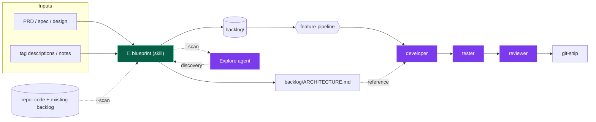

# Blueprint

How the `blueprint` skill turns requirements into work the developer pipeline
can pick up. It sits at the **front of the funnel**: everything upstream of the
`developer` → `tester` → `reviewer` agents.

## What it does

Given fuzzy input — a PRD, spec, design notes, tag descriptions, or free text —
`/blueprint` produces two deliverables under `backlog/`, before any code:

| Deliverable | What it is |
|---|---|
| `backlog/` tree | Epics/features/tasks; each task file *is* the `developer` agent's input contract |
| `ARCHITECTURE.md` | Current → target state, components, decisions, with mermaid diagrams |
| `BACKLOG.md` | Index + status roll-up (done / todo counts) |

**Core insight:** a capable model already writes good task *content* unprompted
— Given/When/Then criteria, dependencies, traceability. What it does *not*
produce is a **stable, machine-readable shape**: YAML frontmatter, a `status`
lifecycle, and a folder/ID scheme that survives re-runs. That shape is the
skill's whole value, so the skill is a **contract to fill in**, not a list of
rules.

## Where it fits



The task file's `id`, `depends_on`, `paths`, and Given/When/Then criteria map
1:1 onto what `developer` and `tester` already read — no translation layer.

## The task contract

Every task is a markdown file with YAML frontmatter plus body:

```markdown
---
id: F01-T02              # feature-scoped, stable — never renumbered on re-run
status: todo             # todo | in-progress | done
priority: high
estimate: M              # S | M | L
depends_on: [F01-T01]
paths: [src/auth/]       # populated only when --scan ran
source: "PRD §2.3"       # traceability to the requirement
---

## Description
## Acceptance Criteria   → Given / When / Then, one scenario per behavior path
## Notes                 → out of scope
```

## Output layout — adaptive depth

```
backlog/
├── ARCHITECTURE.md
├── BACKLOG.md
└── features/
    └── 01-<feature-slug>/
        ├── _feature.md
        └── tasks/
            └── 01-<task-slug>.md
```

- **Tiny** input → flat `backlog/tasks/`.
- **Normal** → `features/NN/tasks/NN` (above).
- **Large** → add an `epics/NN/` level on top.

## Running it

```mermaid
sequenceDiagram
    participant U as you
    participant BP as blueprint
    participant EX as Explore
    participant FS as backlog/

    U->>BP: /blueprint <input> [--scan]
    BP->>BP: capture intent · ask only for gaps
    opt --scan
        BP->>EX: map existing code + features
        EX-->>BP: what exists, where (paths)
    end
    BP->>FS: read existing backlog/ (if any)
    BP->>BP: decompose · diff vs existing · pick depth
    BP->>FS: write tasks + ARCHITECTURE.md (groom, don't clobber)
    BP-->>U: roll-up summary
```



- **`--scan` is opt-in.** Off by default (cheap requirements→backlog pass); on,
  it dispatches the read-only `Explore` agent so tasks aren't created for
  already-built features and `paths` get filled.

## Grooming — safe to re-run

When `backlog/` already exists, `blueprint` reads it first and **refines rather
than regenerates**:

- adds/updates only what changed against the new requirements
- **never rewrites a `status: done` task** — a changed requirement becomes a new
  task, not an edit to shipped work
- keeps every existing `id` stable; appends new ids instead of renumbering
- refreshes the `BACKLOG.md` roll-up

This behavior is verified even under pressure: told "this backlog is a mess,
regenerate it from scratch," the skill preserves done tasks byte-for-byte and
appends new work around them.

## How this skill was built

`blueprint` was written test-first (RED → GREEN → REFACTOR):

1. **RED** — ran a real PRD through fresh agents with *no* skill. They produced
   good content but in an unstable, un-parseable shape (no frontmatter, no
   `status`, a different structure each run). That gap list became the spec.
2. **GREEN** — wrote the minimal contract-and-template skill; re-ran the same
   PRD; all task files came back contract-compliant.
3. **REFACTOR** — pressure-tested grooming; the done-task-preservation rule held.

The `evals/` folder captures these as regression checks.
