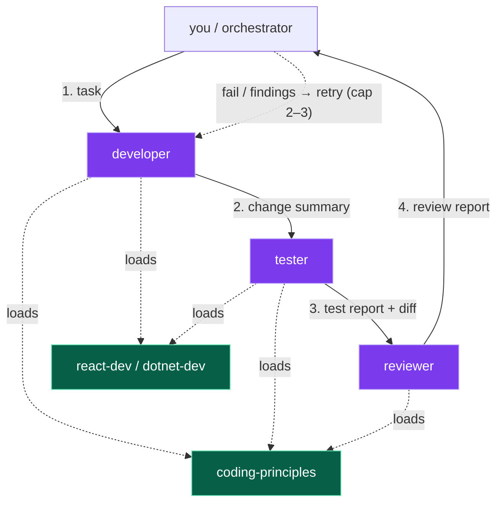
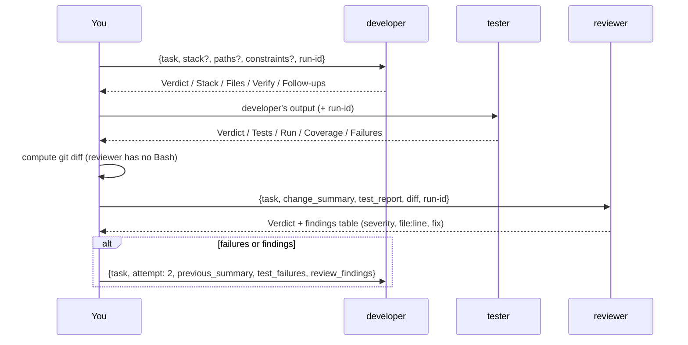

# Development flow

How to build features with the `workflows` plugin's developer pipeline:
three agents (`developer` → `tester` → `reviewer`) that specialize per stack
by loading shared skills.

## The pieces

| Piece | Type | Job |
|---|---|---|
| `developer` | agent | Implements the task; verifies build + pre-existing tests |
| `tester` | agent | Writes + runs new tests for the change; never touches product code |
| `reviewer` | agent | Read-only review of the diff against an explicit rubric |
| `coding-principles` | skill | Universal rules (DRY, KISS, YAGNI, naming, errors) — every agent's baseline |
| `react-dev` | skill | React/TS conventions + `references/testing.md` (Jest/Vitest + RTL) |
| `dotnet-dev` | skill | .NET/C# conventions + `references/testing.md` (xUnit + Moq) |

Two facts shape the design:

1. **Agents can load skills** — that's how one agent handles N stacks.
2. **A subagent can't spawn subagents** — so the retry loop lives in the
   caller (your main thread today; a `feature-pipeline` orchestrator skill
   later), never inside an agent.

## The pipeline

Each stage's output is the next stage's input. Each agent also writes one
artifact to `.pipeline-artifacts/<run-id>/` (gitignore this dir in the target
repo): `change-summary.md`, `test-report.md`, `review-report.md`.

## Running a feature through it

Inputs are prompt strings, conventionally JSON-shaped; free text works too —
agents detect what's missing. Three things only the caller can do:

- **Mint the `run-id`** (timestamp, e.g. `2026-07-04-1015`) and pass it to
  every agent so artifacts land in one place.
- **Hand the reviewer the diff** — it has no `Bash`, deliberately.
- **Carry retry context** — each dispatch is a fresh context; on loop-back,
  pass the previous summary + failures or attempt 2 starts blind.

### Direct use (no pipeline)

Each agent works standalone: "use the developer agent to add X",
"use the tester agent to cover the discount service change",
"use the reviewer agent to review this diff". Skills also auto-trigger in
plain chat — `react-dev` on React questions, `coding-principles` on
"refactor this".

## How the stack gets picked

Agents route, skills carry knowledge:

- `stack` hint in the input wins.
- Else repo signals: `package.json` + react / `.tsx` → `react-dev`;
  `.csproj` / `.sln` / `.cs` → `dotnet-dev`.
- Full-stack task → load **both**, implement/test both sides.
- Test frameworks come from the stack skill's `references/testing.md` —
  never hardcoded in an agent. Developer and tester read the same skill, so
  a component and its tests share conventions.

**Adding a stack** = one new skill (`SKILL.md` + `references/testing.md`) +
one routing line in `developer`/`tester`. No agent rewrite.

## Who verifies what

| | build | pre-existing tests | new tests | product code edits |
|---|---|---|---|---|
| developer | ✅ | ✅ | ❌ (tester's) | ✅ |
| tester | ❌ | ❌ | ✅ | ❌ never |
| reviewer | ❌ | ❌ | ❌ | ❌ never (report-only `Write`) |

This split keeps reports honest: nobody claims work another agent owns, and
a reviewer that can't edit code stays a reviewer.
