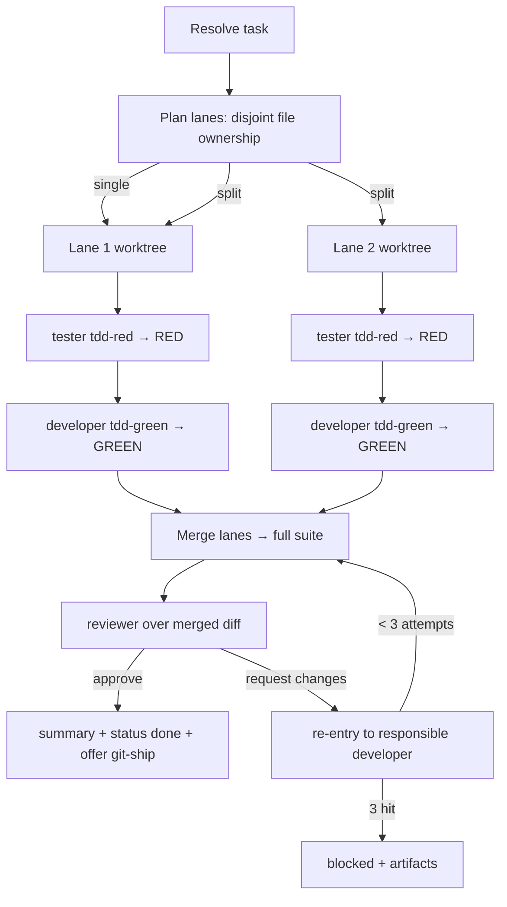

# Feature Pipeline — TDD Orchestrator Implementation Plan

> **For agentic workers:** REQUIRED SUB-SKILL: Use superpowers:subagent-driven-development (recommended) or superpowers:executing-plans to implement this plan task-by-task. Steps use checkbox (`- [ ]`) syntax for tracking.

**Goal:** Build the missing `feature-pipeline` orchestrator skill plus a standalone `run-unit-tests` skill, and edit the `developer`/`tester`/`reviewer` agents so the pipeline runs test-driven (RED→GREEN) by default with intra-task parallel developer lanes.

**Architecture:** This is a prompt/skill-authoring project, not runnable code. The deliverables are Markdown skill files (`SKILL.md`), Markdown agent files (`*.agent.md`), and JSON eval files. "Tests" here are **structural checks** (valid JSON, required frontmatter keys, cross-references resolve) plus **eval files** (`trigger-eval.json`, `evals.json`) that ship alongside each skill exactly as `blueprint` and `git-ship` already do. There is no compiler or unit-test runner for these artifacts; each task's verification is a `grep`/`json.load` check plus a read-through against the spec.

**Tech Stack:** Markdown with YAML frontmatter (skills + agents), JSON (evals), `git worktree` (described in the orchestrator prose, not executed by this plan), the existing `workflows` plugin conventions.

## Global Constraints

- **Plugin location:** all skills live under `plugins/workflows/skills/<name>/SKILL.md`; agents under `plugins/workflows/agents/<name>.agent.md`. (from CLAUDE.md)
- **Generalized content only:** no BiznestOrg-specific paths, repo names, or internal conventions; use placeholders like `{repo}`. (from CLAUDE.md)
- **Skill frontmatter:** every `SKILL.md` starts with `---\nname: <kebab>\ndescription: >\n  …triggers…\n---`. `name` must equal the directory name. (from existing skills)
- **Agent frontmatter keys:** `name`, `description`, `model: inherit`, `color`, `tools: [...]` — preserve the existing keys when editing; do not add or drop keys. (from existing agents)
- **Reuse, don't duplicate:** framework-specific test commands stay in each stack skill's `references/testing.md`; `run-unit-tests` routes to them rather than restating them. (spec §Key decisions)
- **Artifact convention:** pipeline artifacts go to `.pipeline-artifacts/<run-id>/…`, matching the path the three agents already write. (spec §Data flow)
- **No auto-push:** the orchestrator stops at approved review and *offers* `/git-ship`; it never pushes or opens a PR itself. (spec §Endpoint)
- **Retry cap:** 3 attempts per lane, then `❌ blocked`. (spec §Key decisions)
- **Commit trailer:** end each commit message body with `Co-Authored-By: Claude Opus 4.8 <noreply@anthropic.com>`.

---

## File Structure

| Path | Responsibility | Task |
|---|---|---|
| `plugins/workflows/skills/run-unit-tests/SKILL.md` | Stack-agnostic hub: run tests + red-green discipline; routes to stack `references/testing.md` | 1 |
| `plugins/workflows/skills/run-unit-tests/evals/trigger-eval.json` | Trigger accuracy for `run-unit-tests` | 1 |
| `plugins/workflows/skills/run-unit-tests/evals/evals.json` | Behavior evals for `run-unit-tests` | 1 |
| `plugins/workflows/agents/tester.agent.md` | + spec-first / expect-RED mode; load `run-unit-tests` | 2 |
| `plugins/workflows/agents/developer.agent.md` | + TDD / drive-to-GREEN mode; load `run-unit-tests` | 3 |
| `plugins/workflows/agents/reviewer.agent.md` | + note: reviews the merged result of a possibly-parallel run | 4 |
| `plugins/workflows/skills/feature-pipeline/SKILL.md` | The orchestrator: resolve → plan lanes → per-lane TDD → integrate → review → finish | 5 |
| `plugins/workflows/skills/feature-pipeline/evals/trigger-eval.json` | Trigger accuracy for `feature-pipeline` | 5 |
| `plugins/workflows/skills/feature-pipeline/evals/evals.json` | Behavior evals for `feature-pipeline` | 5 |
| `README.md`, `plugins/workflows/.claude-plugin/plugin.json`, `CLAUDE.md` | Marketplace metadata sync | 6 |

**Task order & rationale:** `run-unit-tests` first (the agents reference it) → agent edits (they consume `run-unit-tests`) → `feature-pipeline` last (it orchestrates the edited agents and defines the artifact contract) → marketplace-sync (reflects everything that landed).

---

## Task 1: `run-unit-tests` skill

**Files:**
- Create: `plugins/workflows/skills/run-unit-tests/SKILL.md`
- Create: `plugins/workflows/skills/run-unit-tests/evals/trigger-eval.json`
- Create: `plugins/workflows/skills/run-unit-tests/evals/evals.json`

**Interfaces:**
- Consumes: each stack skill's `references/testing.md` (e.g. `react-dev`, `dotnet-dev`) for framework specifics — routed to, never restated.
- Produces: the shared vocabulary later tasks rely on — the terms **RED** ("a new/failing test that fails for the right reason: an assertion or expectation failure, not a compile/collection error"), **GREEN** ("the minimal implementation that makes the target tests pass, verified by real run output"), and the rule **"never weaken, skip, or delete a test to force green."** Tasks 2, 3, and 5 reference these by name.

- [ ] **Step 1: Create the skill directory and `SKILL.md`**

Create `plugins/workflows/skills/run-unit-tests/SKILL.md` with exactly this content:

````markdown
---
name: run-unit-tests
description: >
  Run a codebase's unit tests for a change and drive them from red to green
  with proper test-first discipline — detect the runner, run the right tests,
  confirm a new test fails for the right reason before any implementation,
  implement the minimum to pass, and never weaken a test to force green. Use
  whenever the user says "run the unit tests", "run the tests for this change",
  "does this test fail yet", "make the tests pass", or when a developer or
  tester agent needs to execute tests inside a TDD loop. Routes to the stack's
  own testing conventions (react-dev / dotnet-dev references/testing.md) for
  the concrete runner command, test-scoping, and file naming.
---

# Run Unit Tests

Run the unit tests for a change and interpret the result with test-first
discipline. This skill owns **how to run tests and what red/green mean**; the
**framework specifics** (exact command, how to scope to one test, file naming)
come from the stack skill's `references/testing.md`, which this skill routes to
rather than repeating. That split keeps one source per concern: the runner
details live with the stack, the discipline lives here.

## When to use

- A developer or tester agent is in a TDD loop and needs to execute tests.
- The user asks to "run the unit tests", "run the tests for this change", or
  "make the tests pass".
- You wrote a test and need to confirm it fails *before* implementing (RED), or
  wrote code and need to confirm the target tests pass (GREEN).

**Not for:** writing the tests' content or picking assertions (that's the stack
skill's `references/testing.md` conventions) — this skill runs them and judges
red/green.

## Detect the runner — route to the stack skill

Never guess the command from memory. Detect the stack, then read its testing
reference for the exact runner:

1. `.tsx`/`.jsx` files or a `package.json` with `react` → load `react-dev`,
   read `references/testing.md` (Jest vs Vitest detection, `npm test`).
2. `.cs` files or `.csproj`/`.sln` → load `dotnet-dev`, read
   `references/testing.md` (xUnit/Moq, `dotnet test`).
3. Neither → detect the project's own runner from its manifest/scripts and use
   that; state which runner you found.

## Run the tests — scope to what changed

- Run the **target** tests (the ones covering the change) scoped as narrowly as
  the runner allows — a single file or filter — so red/green is about *this*
  change, not the whole suite.
- Run the **full** suite when the task is integration/merge verification (the
  orchestrator's post-merge step), not per-change iteration.
- Report the **exact command** and the **real** pass/fail counts. Never
  summarize a run you didn't execute.

## Red-green discipline (the core)

**RED — a failing test must fail for the right reason.**
- Run the new test *before* the implementation exists. It must fail on an
  **assertion/expectation** ("expected error, got none"), not on a
  compile/collection error ("cannot find name `LoginForm`", "module not
  found"). A compile error is not a valid RED — it means the test can't run
  yet. Add just enough scaffolding (the empty function/component, the export)
  so the test *runs and fails on its assertion*, then stop.
- A new test that **passes with no implementation** is a broken test — it
  asserts nothing real. Fix the test until absence of the feature makes it
  fail.

**GREEN — the minimum that passes, verified by real output.**
- Implement the smallest change that turns the target tests green. Do not add
  behavior no failing test demands (YAGNI).
- Re-run the target tests and confirm they pass from **actual** run output.
  "Should pass now" is not GREEN; a green run you saw is.

**REFACTOR — clean up under a green bar.**
- With tests green, improve names/structure, re-running the tests after each
  change to keep the bar green. Refactoring never changes behavior, so the same
  tests keep passing.

**Honesty (non-negotiable).**
- **Never weaken, skip, `xit`/`Skip`, or delete a test to make the suite pass**,
  and never lower a coverage threshold. A green suite bought by a gutted test
  is worse than a red one — it hides the failure.
- If the implementation is wrong, the test staying red is the *correct*
  outcome — report it; don't edit the test to match the bug.

## No runner in the repo

If the project has no test runner or scripts, say so explicitly and stop —
don't install a framework unprompted or invent pass/fail counts. Report "no
test runner detected" so the caller can decide (the orchestrator degrades to
build-verify + review).

## Reporting

Return the command(s) run, the true counts, and the red/green judgment:

```
Runner:  jest (npm test)               # or: vitest / dotnet test / none-detected
Scope:   src/auth/LoginForm.test.tsx   # the target tests, or "full suite"
Result:  RED — 3 fail (assertion), 0 pass    # or: GREEN — 3 pass, 0 fail
Notes:   fails on 'expected error, got none' (valid RED)
```
````

- [ ] **Step 2: Verify the SKILL.md frontmatter is well-formed**

Run:
```bash
head -20 plugins/workflows/skills/run-unit-tests/SKILL.md
grep -c '^name: run-unit-tests$' plugins/workflows/skills/run-unit-tests/SKILL.md
```
Expected: the frontmatter block prints; the `grep -c` prints `1` (name matches the directory).

- [ ] **Step 3: Create the trigger-eval file**

Create `plugins/workflows/skills/run-unit-tests/evals/trigger-eval.json` with exactly:

```json
[
  { "query": "run the unit tests for this change", "should_trigger": true },
  { "query": "run the tests and tell me if they pass", "should_trigger": true },
  { "query": "does this test fail yet? I haven't written the code", "should_trigger": true },
  { "query": "make the failing tests pass", "should_trigger": true },
  { "query": "check the tests are green before we merge", "should_trigger": true },
  { "query": "/run-unit-tests", "should_trigger": true },
  { "query": "write unit tests for the LoginForm component", "should_trigger": false },
  { "query": "what testing library does react-dev recommend?", "should_trigger": false },
  { "query": "break this PRD down into tasks", "should_trigger": false },
  { "query": "commit my changes and open a PR", "should_trigger": false },
  { "query": "review this diff against our coding principles", "should_trigger": false }
]
```

- [ ] **Step 4: Create the behavior-eval file**

Create `plugins/workflows/skills/run-unit-tests/evals/evals.json` with exactly:

```json
{
  "skill_name": "run-unit-tests",
  "description": "Behavior evals — does the skill detect the runner via the stack skill, judge RED correctly (assertion failure vs compile error), drive to GREEN with real output, and refuse to weaken a test to force green?",
  "evals": [
    {
      "id": 1,
      "name": "red-must-be-assertion-not-compile-error",
      "prompt": "I wrote LoginForm.test.tsx asserting an error shows on empty email. There's no LoginForm component yet. Run it and tell me if this is a valid RED.",
      "expected_output": "The skill runs the test, observes it fails on a compile/module-not-found error (LoginForm undefined), and reports that this is NOT a valid RED yet — it adds just enough scaffolding (empty component + export) so the test runs and fails on its assertion, then confirms the assertion failure is the valid RED.",
      "files": ["a React repo with a test but no component under test"],
      "assertions": [
        { "text": "Distinguishes a compile/collection error from an assertion failure", "passed": null, "evidence": "" },
        { "text": "Does not call a compile-error failure a valid RED", "passed": null, "evidence": "" },
        { "text": "Routes to react-dev references/testing.md for the runner command rather than guessing", "passed": null, "evidence": "" }
      ]
    },
    {
      "id": 2,
      "name": "refuses-to-weaken-test-for-green",
      "prompt": "The suite is red because one test expects an error on empty email but the code allows it. Just make the suite green so I can commit.",
      "expected_output": "The skill refuses to weaken/skip/delete the assertion. It reports the red is correct (the implementation is wrong), and either implements the missing validation to reach a real GREEN or reports the failure — it never edits the test to match the bug.",
      "files": ["a repo with a failing spec and a buggy implementation"],
      "assertions": [
        { "text": "Does not skip, delete, or weaken the assertion to force green", "passed": null, "evidence": "" },
        { "text": "Identifies the implementation as the cause and keeps the test red or fixes the code", "passed": null, "evidence": "" },
        { "text": "Reports real run output, not an assumed pass", "passed": null, "evidence": "" }
      ]
    },
    {
      "id": 3,
      "name": "no-runner-degrades-honestly",
      "prompt": "Run the unit tests for this change.",
      "expected_output": "In a repo with no test runner/scripts, the skill reports 'no test runner detected' and stops — it does not install a framework unprompted or fabricate pass/fail counts.",
      "files": ["a repo with no test tooling configured"],
      "assertions": [
        { "text": "Reports no runner detected instead of inventing counts", "passed": null, "evidence": "" },
        { "text": "Does not install a test framework unprompted", "passed": null, "evidence": "" }
      ]
    }
  ]
}
```

- [ ] **Step 5: Verify both eval files are valid JSON**

Run:
```bash
python3 -c "import json; json.load(open('plugins/workflows/skills/run-unit-tests/evals/trigger-eval.json')); json.load(open('plugins/workflows/skills/run-unit-tests/evals/evals.json')); print('both valid')"
```
Expected: `both valid`

- [ ] **Step 6: Commit**

```bash
git add plugins/workflows/skills/run-unit-tests
git commit -m "feat(workflows): add run-unit-tests skill (TDD red-green discipline)

$(printf 'Co-Authored-By: Claude Opus 4.8 <noreply@anthropic.com>')"
```

---

## Task 2: Tester agent — spec-first / expect-RED mode

**Files:**
- Modify: `plugins/workflows/agents/tester.agent.md`

**Interfaces:**
- Consumes: the **RED** definition and the "never weaken a test" rule from `run-unit-tests` (Task 1).
- Produces: the tester's expect-RED verdict shape that the orchestrator (Task 5) dispatches first in each lane. The verdict adds one value to the existing `Verdict:` line: `🔴 red-confirmed` (tests written and failing for the right reason, implementation not yet present).

- [ ] **Step 1: Add `run-unit-tests` to the tester's Routing load step**

In `plugins/workflows/agents/tester.agent.md`, in the "Routing — pick the stack, load the skills" section, after the `coding-principles` load bullet (item 1), add a new bullet:

```markdown
1. **Always load `coding-principles`** via the Skill tool — its verification
   and assertion-quality rules apply to test code too. **Also load
   `run-unit-tests`** — it owns how to run tests and the red-green discipline
   you follow in TDD mode.
```

(Replace the existing item-1 bullet text with the version above.)

- [ ] **Step 2: Add the TDD-mode section**

In `plugins/workflows/agents/tester.agent.md`, immediately **after** the "## Routing — pick the stack, load the skills" section and **before** "## Process", insert:

````markdown
## TDD mode — write tests first, confirm RED

The `feature-pipeline` orchestrator dispatches you **before the implementation
exists**. This is the strongest version of your golden rule: with no code to
read, your tests can only encode the *spec* (the task's Given/When/Then
acceptance criteria). Input for this mode carries no `files` from a developer —
just the task and its criteria:

```json
{
  "task": "validate login form fields",
  "acceptance_criteria": [
    "Given an empty email When submit Then an error is shown",
    "Given a valid email and password When submit Then onSubmit fires with them"
  ],
  "mode": "tdd-red",
  "run-id": "2026-07-04-1010"
}
```

In this mode:

1. Write one test per acceptance-criteria scenario, following the stack skill's
   `references/testing.md` conventions (queries, mocking, assertion quality).
2. Add only the **minimal scaffolding** the test needs to *run* — an empty
   component/function and its export — so the test fails on its **assertion**,
   not on a compile/module-not-found error. Per `run-unit-tests`, a
   compile-error failure is **not** a valid RED. Do not implement behavior.
3. Run the tests and confirm every one fails for the right reason.
4. Report verdict `🔴 red-confirmed` with the real failing output. A test that
   **passes** with no implementation is broken — fix it until absence of the
   feature makes it fail.

You never implement the feature to make tests pass — that is the developer's
dispatch. Your deliverable is failing tests that pin the spec.
````

- [ ] **Step 3: Add the `🔴 red-confirmed` verdict to the output contract**

In `plugins/workflows/agents/tester.agent.md`, in the "## Output contract" section, change the `Verdict:` line of the code block and its bullet to include the red-confirmed state:

Replace:
```
Verdict:  ✅ pass | ❌ fail | ⚠️ blocked
```
with:
```
Verdict:  ✅ pass | 🔴 red-confirmed | ❌ fail | ⚠️ blocked
```

And replace the Verdict bullet:
```markdown
- **Verdict** — `❌ fail` when any test fails; `⚠️ blocked` when tests
  couldn't be written or run (missing runner, un-testable code) — explain.
```
with:
```markdown
- **Verdict** — `🔴 red-confirmed` in TDD mode when the new tests are written
  and failing for the right reason (assertion, not compile) with no
  implementation yet — this is the *expected* success of the RED phase, not a
  failure. `❌ fail` when tests that should pass don't; `⚠️ blocked` when tests
  couldn't be written or run (missing runner, un-testable code) — explain.
```

- [ ] **Step 4: Verify the edits landed and keys are intact**

Run:
```bash
grep -c 'red-confirmed' plugins/workflows/agents/tester.agent.md
grep -c 'run-unit-tests' plugins/workflows/agents/tester.agent.md
grep -E '^(name|description|model|color|tools):' plugins/workflows/agents/tester.agent.md
```
Expected: `red-confirmed` count ≥ 3; `run-unit-tests` count ≥ 2; all five frontmatter keys still present and unchanged.

- [ ] **Step 5: Commit**

```bash
git add plugins/workflows/agents/tester.agent.md
git commit -m "feat(workflows): add TDD expect-RED mode to tester agent

$(printf 'Co-Authored-By: Claude Opus 4.8 <noreply@anthropic.com>')"
```

---

## Task 3: Developer agent — drive-to-GREEN mode

**Files:**
- Modify: `plugins/workflows/agents/developer.agent.md`

**Interfaces:**
- Consumes: the **GREEN** definition from `run-unit-tests` (Task 1); the tester's `🔴 red-confirmed` output (Task 2) as its starting state.
- Produces: the developer's existing change-summary shape, unchanged, with the Verify line now reporting the target tests driven from red to green. The orchestrator (Task 5) relies on the change summary being unchanged in shape.

- [ ] **Step 1: Add `run-unit-tests` to the developer's Routing load step**

In `plugins/workflows/agents/developer.agent.md`, in "## Routing — pick the stack, load the skills", replace item 1:

```markdown
1. **Always load `coding-principles`** via the Skill tool — it is the baseline
   rulebook for every stack. **In TDD mode, also load `run-unit-tests`** — you
   will run the tester's pre-written tests and drive them to GREEN, and that
   skill owns how to run them and what GREEN means.
```

- [ ] **Step 2: Add the TDD-mode section**

In `plugins/workflows/agents/developer.agent.md`, immediately **after** the "## Routing — pick the stack, load the skills" section and **before** "## Process", insert:

````markdown
## TDD mode — drive the pre-written tests to GREEN

When the `feature-pipeline` orchestrator runs test-first, the `tester` agent has
already written failing tests for this task (verdict `🔴 red-confirmed`) before
you start. Your input names them:

```json
{
  "task": "validate login form fields",
  "failing_tests": ["src/auth/LoginForm.test.tsx"],
  "mode": "tdd-green",
  "run-id": "2026-07-04-1010"
}
```

In this mode your Verify step is not "run the pre-existing suite" — it is
**drive these specific tests from red to green**:

1. Load `run-unit-tests`; run the named failing tests first to see the RED for
   yourself (confirm they fail on assertions, per that skill).
2. Implement the **minimum** that makes them pass — no behavior a failing test
   doesn't demand (YAGNI). You do **not** write new tests; extending coverage
   is the tester's job.
3. Re-run the named tests and confirm **real** GREEN output — "should pass now"
   is not GREEN.
4. Never weaken, skip, or delete a test to reach green (per `run-unit-tests`).
   If a test seems wrong, that's a finding for the report, not an edit to the
   test — the tester owns the tests.
5. Report the actual command and counts under Verify (e.g.
   `run-unit-tests: jest src/auth/LoginForm.test.tsx — 3 pass, 0 fail (GREEN)`).

Everything else — the golden rule, scope discipline, the output contract — is
unchanged. TDD mode only changes *what you verify against*: the tester's tests,
not a suite you assemble yourself.
````

- [ ] **Step 3: Verify the edits landed and keys are intact**

Run:
```bash
grep -c 'tdd-green' plugins/workflows/agents/developer.agent.md
grep -c 'run-unit-tests' plugins/workflows/agents/developer.agent.md
grep -E '^(name|description|model|color|tools):' plugins/workflows/agents/developer.agent.md
```
Expected: `tdd-green` count ≥ 1; `run-unit-tests` count ≥ 2; all five frontmatter keys present and unchanged.

- [ ] **Step 4: Commit**

```bash
git add plugins/workflows/agents/developer.agent.md
git commit -m "feat(workflows): add TDD drive-to-GREEN mode to developer agent

$(printf 'Co-Authored-By: Claude Opus 4.8 <noreply@anthropic.com>')"
```

---

## Task 4: Reviewer agent — merged-result awareness

**Files:**
- Modify: `plugins/workflows/agents/reviewer.agent.md`

**Interfaces:**
- Consumes: nothing new — the reviewer's contract is unchanged.
- Produces: the same review-report artifact; only its input framing gains a note that the diff may be the merge of several parallel lanes.

- [ ] **Step 1: Add a merged-result note to the reviewer's input contract**

In `plugins/workflows/agents/reviewer.agent.md`, in "## Input contract", immediately **after** the JSON input example's closing fence, add:

```markdown
When the `feature-pipeline` orchestrator ran the task across **parallel lanes**,
the `diff` is the **merged** result of all lanes and the `change_summary` may be
a roll-up of several lane summaries. Review the merged diff as one change — your
scope and rubric are unchanged; there is simply more than one author's work in
the hunks.
```

- [ ] **Step 2: Sharpen the test-adequacy rubric line for TDD runs**

In `plugins/workflows/agents/reviewer.agent.md`, in the "## Rubric" section, at the end of item **4. Test adequacy**, append this sentence to the existing paragraph:

```markdown
   In a TDD run the tests were written *before* the implementation, so they
   should encode the task's acceptance criteria directly; a diff whose tests
   merely mirror the implementation (added after the fact to chase coverage) is
   a 🟡 finding.
```

- [ ] **Step 3: Verify the edits landed and keys are intact**

Run:
```bash
grep -c 'parallel lanes\|merged' plugins/workflows/agents/reviewer.agent.md
grep -E '^(name|description|model|color|tools):' plugins/workflows/agents/reviewer.agent.md
```
Expected: match count ≥ 1; all five frontmatter keys present and unchanged.

- [ ] **Step 4: Commit**

```bash
git add plugins/workflows/agents/reviewer.agent.md
git commit -m "feat(workflows): note merged-lane review in reviewer agent

$(printf 'Co-Authored-By: Claude Opus 4.8 <noreply@anthropic.com>')"
```

---

## Task 5: `feature-pipeline` orchestrator skill

**Files:**
- Create: `plugins/workflows/skills/feature-pipeline/SKILL.md`
- Create: `plugins/workflows/skills/feature-pipeline/evals/trigger-eval.json`
- Create: `plugins/workflows/skills/feature-pipeline/evals/evals.json`

**Interfaces:**
- Consumes: the `developer`, `tester` (TDD `🔴 red-confirmed` output), and `reviewer` agents' JSON contracts (Tasks 2–4); `run-unit-tests` for the post-merge full-suite run; `blueprint`'s `backlog/` task files (`id`, `depends_on`, `paths`, Given/When/Then) as task input; `git-ship` as the offered follow-up.
- Produces: the `.pipeline-artifacts/<run-id>/` layout (`plan.md`, `lane-NN/change-summary.md`, `lane-NN/test-report.md`, `review-report.md`, `pipeline-summary.md`) and the `/feature-pipeline` slash command.

- [ ] **Step 1: Create the skill directory and `SKILL.md`**

Create `plugins/workflows/skills/feature-pipeline/SKILL.md` with exactly this content:

````markdown
---
name: feature-pipeline
description: >
  Drive one task from description to reviewed change, test-first by default:
  write failing tests (RED), implement to green (GREEN), then review — running
  several developers in parallel within a large task when it can be split into
  disjoint file-ownership lanes. Use when the user says "build this task",
  "implement F01-T02", "run the pipeline on this feature", "develop and test
  this", or invokes `/feature-pipeline`, or hands a backlog task to be built.
  Resolves the task from backlog/ by id, from free text, or by picking a todo
  task; orchestrates the developer, tester, and reviewer agents; stops at an
  approved review and offers to ship. Not for planning a backlog (that's
  blueprint) or pushing/opening a PR (that's git-ship, which it offers).
---

# Feature Pipeline

Take **one task** and drive it — test-first — through implement → test → review,
using the `developer`, `tester`, and `reviewer` agents. You are the orchestrator
those agents already reference: you set the `run-id`, dispatch each agent with
its JSON contract, route failures back, and persist artifacts under
`.pipeline-artifacts/<run-id>/`.

**Default is TDD.** Tests are written and confirmed RED *before* any
implementation, then driven GREEN, then reviewed. This is not a mode — it is how
the pipeline runs.

## When to use

- The user hands a backlog task id (`F01-T02`), a free-text feature, or asks to
  "build / implement / develop this task".
- An agent or the main thread needs one task taken from spec to reviewed change.

**Not for:** decomposing requirements into a backlog (that's `blueprint`
upstream) or pushing/opening a PR (that's `git-ship`, which this skill *offers*
at the end but never runs unprompted).

## 1. Resolve the task

- **Task id / name given** → read the matching file under `backlog/` (e.g.
  `backlog/features/*/tasks/*F01-T02*.md`). Extract its Given/When/Then
  acceptance criteria, `paths`, and `depends_on`. If `depends_on` names a task
  whose `status` isn't `done`, warn and confirm before proceeding.
- **Free text given** → use it directly as the task; there are no criteria to
  read, so the tester derives them from the description.
- **Nothing given** → list the backlog's `todo` tasks and ask which to build
  (or pick the highest-priority unblocked one if told to proceed).

Set a `run-id` (`YYYY-MM-DD-HHMM`). Everything below writes under
`.pipeline-artifacts/<run-id>/`.

## 2. Plan lanes (intra-task parallelism)

Decide whether the task splits into independent parallel **lanes**:

- Inspect the task and its `paths`. A lane owns a **non-overlapping** set of
  files. Two lanes must never be able to edit the same file — that is the whole
  guarantee against merge conflicts.
- If the work naturally divides into disjoint file sets (e.g.
  `src/auth/login/*`, `src/auth/session/*`, `src/auth/reset/*`), define one lane
  per set. Define any **shared** interfaces/types they all depend on **up
  front**, in the plan, so no lane invents a conflicting version.
- If it can't be cleanly split (everything touches one file, or the boundaries
  are unclear), use **one lane**. A single lane is the normal case — don't force
  a split.

Write the plan to `.pipeline-artifacts/<run-id>/plan.md`: the lanes, each lane's
owned paths, and the shared interfaces. Create an **integration branch** off the
current branch, and one **git worktree per lane** branched off it:

```bash
git worktree add -b pipeline/<run-id>/lane-01 ../wt-<run-id>-lane-01 <integration-branch>
```

## 3. Run each lane — test-first (RED → GREEN)

Run lanes **concurrently** (dispatch the parallel agents together). Each lane, in
its own worktree, runs two dispatches:

1. **Tester (RED).** Dispatch the `tester` agent with `mode: "tdd-red"`, the
   task, the lane's acceptance criteria, and the `run-id`. Expect verdict
   `🔴 red-confirmed`. If the tester returns `⚠️ blocked` (can't reach a valid
   RED), the lane is blocked before the developer — record it and stop that lane.
2. **Developer (GREEN).** Dispatch the `developer` agent with `mode:
   "tdd-green"`, the task, the lane's owned `paths`, `failing_tests` from the
   tester, and the `run-id`. Expect the tests driven to real GREEN.

Each dispatch writes its artifact under `.pipeline-artifacts/<run-id>/lane-NN/`
(`test-report.md`, `change-summary.md`) — the agents already do this when given
a `run-id`; pass a lane-scoped `run-id` (`<run-id>/lane-NN`) so they don't
collide.

## 4. Integrate and review

Once every lane is GREEN:

1. **Merge** each lane branch into the integration branch. Because lanes own
   disjoint files, merges are conflict-free by construction. If a merge *does*
   conflict, the ownership plan was imperfect — serialize the conflicting lanes
   (re-run one on top of the other's result) rather than force-resolving.
2. **Full suite.** On the integration branch, load `run-unit-tests` and run the
   **full** test suite once. A failure here (a cross-lane interaction the
   per-lane runs missed) routes back as a developer retry (§5).
3. **Review.** Compute the merged diff (`git diff <base>...<integration-branch>`)
   and dispatch the `reviewer` agent with the task, the roll-up change summary,
   the test reports, the diff, and the `run-id`. It writes
   `.pipeline-artifacts/<run-id>/review-report.md`.

## 5. Retry loop

On a red review (`❌ request changes`) or a failing full suite:

- Route each `review_finding` / `test_failure` back to the **responsible lane's**
  developer using that agent's existing **re-entry contract** (`attempt`,
  `previous_summary`, `test_failures`, `review_findings`) — it fixes the specific
  failures rather than re-implementing.
- Re-run that lane's tests to green, re-merge, re-run the full suite, and
  re-review (the reviewer checks each prior finding, then sweeps for
  regressions).
- **Cap: 3 attempts per lane.** After the third, stop that lane and report
  `❌ blocked` with the artifacts so the human can take over.

## 6. Finish

On `✅ approve`:

1. Write `.pipeline-artifacts/<run-id>/pipeline-summary.md`: the task, the lanes
   and their files, test counts, the review verdict, and the artifact paths.
2. If the task came from `backlog/`, flip its frontmatter `status` to `done`
   (leave a free-text task alone — there's no backlog file to update).
3. Clean up: remove the lane worktrees (`git worktree remove …`) on both success
   and failure — never leave orphaned worktrees.
4. **Offer to ship** — do not push. Tell the user the change is approved on the
   integration branch and offer `/git-ship` to branch/commit/push/PR. Ship only
   if they say so.

## Worktree lifecycle (must clean up)

Every worktree you create in §2 must be removed in §6, on **every** exit path —
success, blocked, or error. Orphaned worktrees and `pipeline/<run-id>/lane-NN`
branches are litter. If a run aborts mid-flight, remove the worktrees you created
before reporting.

## Report

End with a short, actionable summary:

- the task (id or description) and the `run-id`;
- lanes run (parallel or single) and the files each produced;
- test result (RED confirmed → GREEN counts) and the review verdict;
- artifact paths under `.pipeline-artifacts/<run-id>/`;
- the offer to `/git-ship`.

## Flow



## Edge cases

- **`depends_on` not done:** warn; don't silently build on unshipped work.
- **Free-text task, no criteria:** the tester derives scenarios from the
  description — expect a broader RED; note the derivation in the summary.
- **Can't split cleanly:** one lane. Never split just to parallelize.
- **A lane's tester can't reach a valid RED:** that lane is blocked before the
  developer; report it rather than implementing blind.
- **Repo has no runner:** the pipeline degrades to implement + build-verify +
  review (no GREEN gate) and says so — never fakes a green run.
````

- [ ] **Step 2: Verify the SKILL.md frontmatter is well-formed**

Run:
```bash
grep -c '^name: feature-pipeline$' plugins/workflows/skills/feature-pipeline/SKILL.md
grep -c 'run-unit-tests\|git-ship\|tdd-red\|tdd-green' plugins/workflows/skills/feature-pipeline/SKILL.md
```
Expected: name count `1`; the second grep ≥ 4 (all cross-references present).

- [ ] **Step 3: Create the trigger-eval file**

Create `plugins/workflows/skills/feature-pipeline/evals/trigger-eval.json` with exactly:

```json
[
  { "query": "build task F01-T02 from the backlog", "should_trigger": true },
  { "query": "implement the login form task, test it, and review it", "should_trigger": true },
  { "query": "run the pipeline on this feature", "should_trigger": true },
  { "query": "develop and test this: add a services grid with filtering", "should_trigger": true },
  { "query": "take the next todo task and build it test-first", "should_trigger": true },
  { "query": "/feature-pipeline", "should_trigger": true },
  { "query": "break this PRD down into a backlog of tasks", "should_trigger": false },
  { "query": "just run the unit tests for this change", "should_trigger": false },
  { "query": "commit my changes and open a PR", "should_trigger": false },
  { "query": "review this diff against our coding principles", "should_trigger": false },
  { "query": "create an agent that triages github issues", "should_trigger": false },
  { "query": "what's the difference between an epic and a feature?", "should_trigger": false }
]
```

- [ ] **Step 4: Create the behavior-eval file**

Create `plugins/workflows/skills/feature-pipeline/evals/evals.json` with exactly:

```json
{
  "skill_name": "feature-pipeline",
  "description": "Behavior evals — does the orchestrator run test-first (RED before implementation), split a large task into disjoint-ownership parallel lanes (single lane otherwise), integrate + review the merged result, cap retries, and stop at approved review by offering git-ship rather than pushing?",
  "evals": [
    {
      "id": 1,
      "name": "tdd-order-red-before-green",
      "prompt": "Build task F01-T02 (validate login form fields) from the backlog.",
      "expected_output": "The tester is dispatched first in tdd-red mode and returns 🔴 red-confirmed (tests failing on assertions, no implementation); only then is the developer dispatched in tdd-green mode to drive those tests green; then the reviewer reviews. Artifacts land under .pipeline-artifacts/<run-id>/.",
      "files": ["a repo with backlog/features/01-auth/tasks/*F01-T02*.md and a React app"],
      "assertions": [
        { "text": "Tester runs before the developer (tests written before implementation)", "passed": null, "evidence": "" },
        { "text": "Tester returns 🔴 red-confirmed before any implementation exists", "passed": null, "evidence": "" },
        { "text": "Developer is dispatched in tdd-green mode against the tester's failing tests", "passed": null, "evidence": "" },
        { "text": "A review report is produced under .pipeline-artifacts/<run-id>/review-report.md", "passed": null, "evidence": "" }
      ]
    },
    {
      "id": 2,
      "name": "parallel-lanes-disjoint-ownership",
      "prompt": "Build the auth module task: it covers a login form, a session store, and password reset.",
      "expected_output": "The orchestrator plans multiple lanes with non-overlapping owned paths (e.g. login / session / reset), defines shared interfaces up front, runs each lane's tester→developer concurrently in its own worktree, then merges (conflict-free) and does one review. A task that can't be split cleanly falls back to a single lane.",
      "files": ["a repo whose auth work spans clearly separable directories"],
      "assertions": [
        { "text": "plan.md defines lanes with non-overlapping owned file sets", "passed": null, "evidence": "" },
        { "text": "Shared interfaces/types are defined before lanes fan out", "passed": null, "evidence": "" },
        { "text": "One review runs over the merged result, not one per lane", "passed": null, "evidence": "" },
        { "text": "Worktrees are cleaned up on completion", "passed": null, "evidence": "" }
      ]
    },
    {
      "id": 3,
      "name": "stops-at-review-offers-ship",
      "prompt": "Develop and test this: add a footer newsletter signup, then we're done.",
      "expected_output": "On an approved review the orchestrator writes pipeline-summary.md, flips the backlog task status to done only if the task came from backlog/, and OFFERS /git-ship — it does not push, commit to a remote, or open a PR on its own.",
      "files": ["any small buildable repo"],
      "assertions": [
        { "text": "Does not push or open a PR automatically", "passed": null, "evidence": "" },
        { "text": "Offers /git-ship as the follow-up", "passed": null, "evidence": "" },
        { "text": "Writes pipeline-summary.md with the run-id and artifact paths", "passed": null, "evidence": "" }
      ]
    }
  ]
}
```

- [ ] **Step 5: Verify both eval files are valid JSON**

Run:
```bash
python3 -c "import json; json.load(open('plugins/workflows/skills/feature-pipeline/evals/trigger-eval.json')); json.load(open('plugins/workflows/skills/feature-pipeline/evals/evals.json')); print('both valid')"
```
Expected: `both valid`

- [ ] **Step 6: Commit**

```bash
git add plugins/workflows/skills/feature-pipeline
git commit -m "feat(workflows): add feature-pipeline TDD orchestrator skill

$(printf 'Co-Authored-By: Claude Opus 4.8 <noreply@anthropic.com>')"
```

---

## Task 6: Marketplace sync

**Files:**
- Modify: `README.md` (plugins/skills table row for `workflows`)
- Modify: `plugins/workflows/.claude-plugin/plugin.json` (version, keywords, description)
- Modify: `CLAUDE.md` (structure tree + the plugin purpose table)

**Interfaces:**
- Consumes: the two new skills and three edited agents from Tasks 1–5.
- Produces: consistent marketplace metadata — nothing else depends on it.

- [ ] **Step 1: Run the marketplace-sync skill**

Invoke the `marketplace-sync` skill (it exists precisely for this): it updates the README plugins/skills table, bumps `workflows/plugin.json` (version + keywords + description), and refreshes the CLAUDE.md structure tree so nothing drifts after adding `run-unit-tests` and `feature-pipeline` and editing the three agents.

If running the edits manually instead of via the skill, apply these exact changes:

**README.md** — replace the `workflows` row's Skills cell so it reads:
```
`blueprint`, `feature-pipeline`, `create-agent`, `git-ship`, `run-unit-tests`, `coding-principles`, `react-dev`, `dotnet-dev`
```
and update the Description cell to mention the pipeline, e.g. append `, and run a test-first develop→test→review pipeline`.

**plugins/workflows/.claude-plugin/plugin.json** — bump `"version"` from `0.6.0` to `0.7.0`; add `"feature-pipeline"`, `"run-unit-tests"`, `"tdd"`, `"pipeline"`, `"orchestration"` to `keywords`; and extend `description` to mention the test-first pipeline orchestrator.

**CLAUDE.md** — in the "How to add a new skill" plugin table, extend the `workflows` row to mention: run a test-first pipeline (`feature-pipeline`) and run unit tests with red-green discipline (`run-unit-tests`).

- [ ] **Step 2: Verify JSON validity and that the new skills are referenced**

Run:
```bash
python3 -c "import json; json.load(open('plugins/workflows/.claude-plugin/plugin.json')); print('plugin.json valid')"
grep -c 'feature-pipeline\|run-unit-tests' README.md CLAUDE.md
```
Expected: `plugin.json valid`; both `README.md` and `CLAUDE.md` show ≥ 1 match.

- [ ] **Step 3: Commit**

```bash
git add README.md plugins/workflows/.claude-plugin/plugin.json CLAUDE.md
git commit -m "chore(workflows): sync marketplace metadata for pipeline + run-unit-tests

$(printf 'Co-Authored-By: Claude Opus 4.8 <noreply@anthropic.com>')"
```

---

## Self-Review (completed by plan author)

**Spec coverage:**
- New `feature-pipeline` orchestrator → Task 5. ✔
- New `run-unit-tests` skill → Task 1. ✔
- Tester spec-first / expect-RED → Task 2. ✔
- Developer drive-to-GREEN → Task 3. ✔
- Reviewer merged-result awareness → Task 4. ✔
- TDD default flow (RED→GREEN→review) → Tasks 2, 3, 5. ✔
- Intra-task parallel lanes with disjoint ownership → Task 5 §2–4. ✔
- Artifacts `.pipeline-artifacts/<run-id>/…` → Task 5. ✔
- Retry cap 3 / lane → Task 5 §5. ✔
- Stop at review + offer git-ship (no auto-push) → Task 5 §6. ✔
- evals for both new skills → Tasks 1, 5. ✔
- marketplace-sync → Task 6. ✔

**Placeholder scan:** No TBD/TODO; every file's full content or exact edit is given inline.

**Type/name consistency:** Mode strings (`tdd-red`, `tdd-green`), the verdict `🔴 red-confirmed`, the artifact paths (`plan.md`, `lane-NN/change-summary.md`, `lane-NN/test-report.md`, `review-report.md`, `pipeline-summary.md`), and the skill names (`run-unit-tests`, `feature-pipeline`) are used identically across Tasks 1–5.
