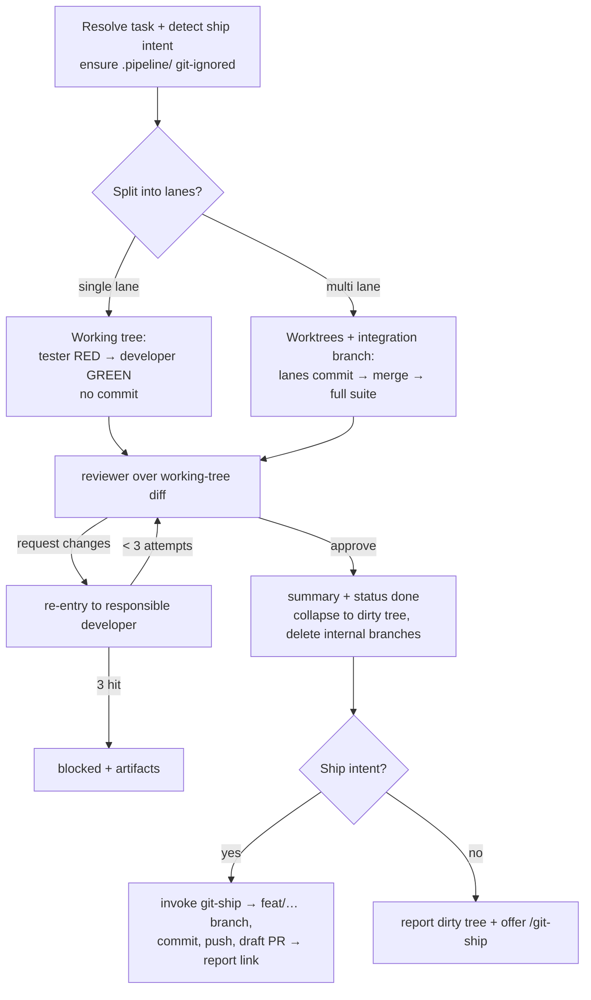

# Feature Pipeline — Git Handoff & Artifacts Fix Implementation Plan

> **For agentic workers:** REQUIRED SUB-SKILL: Use superpowers:subagent-driven-development (recommended) or superpowers:executing-plans to implement this plan task-by-task. Steps use checkbox (`- [ ]`) syntax for tracking.

**Goal:** Make `feature-pipeline`'s git plumbing invisible (it ends with a dirty working tree, git-ship owns all git work), move run artifacts to a git-ignored `.pipeline/feature-pipeline/<run-id>/`, and have the ending honor the invocation's shipping intent.

**Architecture:** Edits to markdown skill/agent files plus two eval JSON files in the `workflows` plugin — no executable code. The substantive change is a rewrite of `feature-pipeline/SKILL.md`; the agents and evals get a path rename; marketplace metadata is synced last. Verification is by `grep`/read of the changed prose and JSON validity, not a unit-test runner.

**Tech Stack:** Claude Code plugin marketplace (markdown + JSON). Reference: approved spec `docs/superpowers/specs/2026-07-05-feature-pipeline-git-artifacts-fix-design.md`.

## Global Constraints

- Artifact path is exactly `.pipeline/feature-pipeline/<run-id>/` everywhere (no `.pipeline-artifacts/` may remain in `plugins/`).
- The pipeline **never** commits, branches, pushes, or opens a PR itself — `git-ship` does all git-facing work.
- The pipeline ends with the approved change as **uncommitted working-tree edits** on the branch the user started on.
- **Single lane is the common case and uses no worktree and no integration branch**; only multi-lane uses worktrees + an integration branch, and it collapses back to a dirty tree at the end.
- Artifacts are **git-ignored** — the pipeline ensures `.pipeline/` is in `.gitignore` before writing artifacts (git-ship runs `git add -A`).
- Shipping-intent signals: the invocation contains "and open a PR", "open a pr", "ship it", "ship this", "and push", "raise an MR", "raise a PR", or a `--ship` flag. Absent any signal → offer only.
- `git-ship` itself is **not modified** — it already turns a dirty tree on a base branch into a `feat/…` branch → commit → push → draft PR and respects `.gitignore`.
- Skills are generalized (no org-specific paths); follow the repo's existing SKILL.md / agent.md style.

---

### Task 1: Rename the artifact path in the three agents

Purely mechanical: the `developer`, `tester`, and `reviewer` agents each name the artifact directory twice. Update every occurrence to the new path. No behavioral change.

**Files:**
- Modify: `plugins/workflows/agents/tester.agent.md` (lines 131, 174)
- Modify: `plugins/workflows/agents/developer.agent.md` (lines 135, 171)
- Modify: `plugins/workflows/agents/reviewer.agent.md` (lines 151, 188)

**Interfaces:**
- Produces: the artifact path string `.pipeline/feature-pipeline/<run-id>/` that Task 2's SKILL.md and Task 3's evals must match verbatim.

- [ ] **Step 1: Replace every occurrence in all three files**

In each of the three files, replace all occurrences of the literal string
`.pipeline-artifacts/<run-id>/` with `.pipeline/feature-pipeline/<run-id>/`.
There are exactly two occurrences per file (6 total). The surrounding text is
unchanged — only the directory prefix changes. For example in
`tester.agent.md`:

- `write it to `\``.pipeline-artifacts/<run-id>/test-report.md`\`` in the target`
  → `write it to `\``.pipeline/feature-pipeline/<run-id>/test-report.md`\`` in the target`
- ``…the same report goes to `.pipeline-artifacts/<run-id>/test-report.md`.``
  → ``…the same report goes to `.pipeline/feature-pipeline/<run-id>/test-report.md`.``

Do the analogous replacement for `developer.agent.md`
(`change-summary.md`) and `reviewer.agent.md` (`review-report.md`).

- [ ] **Step 2: Verify no old path remains and the new path count is right**

Run:
```bash
grep -rn "pipeline-artifacts" plugins/workflows/agents/ ; echo "exit:$?"
grep -rc "\.pipeline/feature-pipeline/<run-id>/" plugins/workflows/agents/*.md
```
Expected: the first `grep` prints nothing and `exit:1` (no matches left). The
second prints `2` for each of the three agent files.

- [ ] **Step 3: Commit**

```bash
git add plugins/workflows/agents/tester.agent.md plugins/workflows/agents/developer.agent.md plugins/workflows/agents/reviewer.agent.md
git commit -m "refactor(workflows): move agent artifact path to .pipeline/feature-pipeline"
```

---

### Task 2: Rewrite `feature-pipeline/SKILL.md` — invisible git, dirty-tree end, ship-intent

This is the substantive task. Replace the whole SKILL.md body with the version
below. It changes: the frontmatter description, the artifact path throughout,
§1 (ship-intent detection + `.gitignore` guarantee), §2 (single lane uses no
worktree), §3 (single lane doesn't commit; multi-lane unchanged), §4 (single
lane reviews the working-tree diff), §6 (collapse to dirty tree + ship-or-offer
per intent), the worktree-lifecycle note, the Report, the Flow diagram, and the
edge cases.

**Files:**
- Modify: `plugins/workflows/skills/feature-pipeline/SKILL.md` (full body replacement)

**Interfaces:**
- Consumes: the artifact path from Task 1; the `tester`/`developer`/`reviewer`
  JSON contracts (unchanged); the `git-ship` skill (invoked by name, unchanged).
- Produces: the pipeline behavior the Task 3 evals assert (dirty-tree end, no
  pipeline-created branch on single lane, offer-by-default / auto-ship-on-intent).

- [ ] **Step 1: Replace the entire file with this content**

````markdown
---
name: feature-pipeline
description: >
  Drive one task from description to reviewed change, test-first by default:
  write failing tests (RED), implement to green (GREEN), then review — running
  several developers in parallel within a large task when it can be split into
  disjoint file-ownership lanes. Use when the user says "build this task",
  "implement F01-T02", "run the pipeline on this feature", "develop and test
  this", or invokes `/feature-pipeline`, or hands a backlog task to be built.
  Resolves the task from backlog/ by id, from free text, or by picking a todo
  task; orchestrates the developer, tester, and reviewer agents. Ends with the
  approved change as uncommitted working-tree edits and hands all git work to
  git-ship — offering it by default, or running it automatically when the
  request asks to ship (e.g. "and open a PR"). Not for planning a backlog
  (that's blueprint).
---

# Feature Pipeline

Take **one task** and drive it — test-first — through implement → test → review,
using the `developer`, `tester`, and `reviewer` agents. You are the orchestrator
those agents already reference: you set the `run-id`, dispatch each agent with
its JSON contract, route failures back, and persist artifacts under
`.pipeline/feature-pipeline/<run-id>/`.

**Default is TDD.** Tests are written and confirmed RED *before* any
implementation, then driven GREEN, then reviewed. This is not a mode — it is how
the pipeline runs.

**You never touch git-facing state.** You do not commit, branch, push, or open a
PR. Your job ends with the approved change sitting as **uncommitted edits in the
working tree** on the branch the user started on. All branching, committing,
pushing, and PR work belongs to `git-ship`, which you either offer or invoke
(§6). Any git branches/worktrees you create for parallel lanes are internal
plumbing, torn down before you finish.

## When to use

- The user hands a backlog task id (`F01-T02`), a free-text feature, or asks to
  "build / implement / develop this task".
- An agent or the main thread needs one task taken from spec to reviewed change.

**Not for:** decomposing requirements into a backlog (that's `blueprint`
upstream). Shipping *is* part of this pipeline now — it hands off to `git-ship`
at the end (§6) rather than excluding it.

## 1. Resolve the task

- **Task id / name given** → read the matching file under `backlog/` (e.g.
  `backlog/features/*/tasks/*F01-T02*.md`). Extract its Given/When/Then
  acceptance criteria, `paths`, and `depends_on`. If `depends_on` names a task
  whose `status` isn't `done`, warn and confirm before proceeding.
- **Free text given** → use it directly as the task; there are no criteria to
  read, so the tester derives them from the description.
- **Nothing given** → list the backlog's `todo` tasks and ask which to build
  (or pick the highest-priority unblocked one if told to proceed).

Set a `run-id` (`YYYY-MM-DD-HHMM`). Everything below writes under
`.pipeline/feature-pipeline/<run-id>/`.

**Detect shipping intent.** Note whether the invocation asks to ship — it
contains a ship phrase ("and open a PR", "open a pr", "ship it", "ship this",
"and push", "raise an MR", "raise a PR") or an explicit `--ship` flag. Record
this now; §6 uses it to decide whether to *run* `git-ship` or merely *offer* it.
Absent any such signal, the default is offer-only.

**Ensure artifacts are git-ignored.** Before writing any artifact, make sure the
repo ignores the artifact tree — otherwise `git-ship`'s `git add -A` would sweep
it into the commit. If the repo-root `.gitignore` has no line matching
`.pipeline/`, append `.pipeline/` to it; if there is no `.gitignore`, create one
containing `.pipeline/`.

```bash
grep -qxF '.pipeline/' .gitignore 2>/dev/null || printf '.pipeline/\n' >> .gitignore
```

## 2. Plan lanes (intra-task parallelism)

Decide whether the task splits into independent parallel **lanes**:

- Inspect the task and its `paths`. A lane owns a **non-overlapping** set of
  files. Two lanes must never be able to edit the same file — that is the whole
  guarantee against merge conflicts.
- **Single lane — the normal case.** If the work can't be cleanly split
  (everything touches one file, or the boundaries are unclear), use **one lane**,
  and do **not** create a worktree or integration branch. The tester and
  developer work directly in the current working tree on the current branch.
  Write the plan note to `.pipeline/feature-pipeline/<run-id>/plan.md` (task,
  single lane, owned paths). Don't force a split just to parallelize.
- **Multiple lanes.** Only when the work naturally divides into disjoint file
  sets (e.g. `src/auth/login/*`, `src/auth/session/*`, `src/auth/reset/*`),
  define one lane per set, and define any **shared** interfaces/types they all
  depend on **up front**, in the plan, so no lane invents a conflicting version.
  Write `plan.md` with the lanes, each lane's owned paths, and the shared
  interfaces. Create an **integration branch** off the current branch, and one
  **git worktree per lane** branched off it:

  ```bash
  git worktree add -b pipeline/<run-id>/lane-01 ../wt-<run-id>-lane-01 <integration-branch>
  ```

## 3. Run each lane — test-first (RED → GREEN)

**Single lane.** In the current working tree, run two dispatches:

1. **Tester (RED).** Dispatch the `tester` agent with `mode: "tdd-red"`, the
   task, the acceptance criteria, and the `run-id`. Expect verdict
   `🔴 red-confirmed`. If the tester returns `⚠️ blocked` (can't reach a valid
   RED), stop — report it and don't implement blind.
2. **Developer (GREEN).** Dispatch the `developer` agent with `mode:
   "tdd-green"`, the task, the lane's owned `paths`, `failing_tests` from the
   tester, and the `run-id`. Expect the tests driven to real GREEN.

Do **not** commit. The tester and developer only write files; the change stays
uncommitted in the working tree — exactly the state §6 hands to `git-ship`.

**Multiple lanes.** Run lanes **concurrently** (dispatch the parallel agents
together). Each lane, in its own worktree, runs three steps:

1. **Tester (RED)** and **2. Developer (GREEN)** as above, but pass a
   lane-scoped `run-id` (`<run-id>/lane-NN`) so the agents' artifacts don't
   collide.
3. **Commit the lane.** Once the developer reports GREEN, commit the lane's code
   and tests on its branch from inside the worktree
   (`git -C <lane-worktree> add -A && git -C <lane-worktree> commit -m
   "feat: <task> (lane NN)"`). This is mandatory: the developer and tester only
   *write* files, so their work sits uncommitted inside the isolated worktree,
   and `git merge` in §4 carries only committed history. Then copy the lane's
   `.pipeline/feature-pipeline/<run-id>/lane-NN/` directory from the worktree
   back into the main repo so the consolidated artifact tree survives worktree
   cleanup.

Each agent dispatch writes its artifact (`test-report.md`, `change-summary.md`)
under `.pipeline/feature-pipeline/<run-id>/` (single lane) or
`.pipeline/feature-pipeline/<run-id>/lane-NN/` (multi lane) — the agents already
do this when given a `run-id`.

## 4. Integrate and review

**Single lane.** There is no merge. Stage the change so the diff includes new
files, and hand the reviewer that diff:

```bash
git add -A                                  # safe: .pipeline/ is git-ignored (§1)
git diff --cached > .pipeline/feature-pipeline/<run-id>/merged.diff
```

Dispatch the `reviewer` agent with the task, the developer's change summary, the
test report, the diff file, and the `run-id`. It writes
`.pipeline/feature-pipeline/<run-id>/review-report.md`. (Staging is harmless and
reversible — `git-ship` re-runs `git add -A` in §6.)

**Multiple lanes.** Once every lane is GREEN:

1. **Merge** each lane branch — now carrying its committed code and tests (§3) —
   into the integration branch. Because lanes own disjoint files, merges are
   conflict-free by construction. If a merge *does* conflict, the ownership plan
   was imperfect — serialize the conflicting lanes (re-run one on top of the
   other's result) rather than force-resolving.
2. **Full suite.** On the integration branch, load `run-unit-tests` and run the
   **full** test suite once. A failure here (a cross-lane interaction the
   per-lane runs missed) routes back as a developer retry (§5).
3. **Review.** Compute the merged diff
   (`git diff <base>...<integration-branch> > .pipeline/feature-pipeline/<run-id>/merged.diff`)
   and dispatch the `reviewer` agent with the task, the roll-up change summary,
   the test reports, the diff file, and the `run-id`. It writes
   `.pipeline/feature-pipeline/<run-id>/review-report.md`.

## 5. Retry loop

On a red review (`❌ request changes`) or a failing full suite:

- Route each `review_finding` / `test_failure` back to the **responsible lane's**
  developer using that agent's existing **re-entry contract** (`attempt`,
  `previous_summary`, `test_failures`, `review_findings`) — it fixes the specific
  failures rather than re-implementing.
- Re-run that lane's tests to green, re-merge (multi lane), re-run the full suite
  (multi lane), and re-review (the reviewer checks each prior finding, then
  sweeps for regressions).
- **Cap: 3 attempts per lane.** After the third, stop that lane and report
  `❌ blocked` with the artifacts so the human can take over.

## 6. Finish

On `✅ approve`:

1. Write `.pipeline/feature-pipeline/<run-id>/pipeline-summary.md`: the task, the
   lanes and their files, test counts, the review verdict, and the artifact
   paths.
2. If the task came from `backlog/`, flip its frontmatter `status` to `done`
   (this edits a tracked file, so it rides along in the eventual commit —
   desired). Leave a free-text task alone.
3. **Land the change as a dirty working tree.**
   - **Single lane:** the working tree already holds the uncommitted change —
     nothing to collapse.
   - **Multiple lanes:** from the main repo, still on the user's starting branch,
     bring the integration result into the working tree as uncommitted changes,
     then tear down all internal branches and worktrees:
     ```bash
     git restore --source=<integration-branch> --worktree -- .
     git worktree remove ../wt-<run-id>-lane-01        # repeat per lane
     git branch -D pipeline/<run-id>/lane-01           # repeat per lane
     git branch -D <integration-branch>
     ```
   Because the starting branch never moved during the run, the restore is a clean
   overwrite, not a merge. Confirm nothing internal remains:
   ```bash
   git worktree list ; git branch --list 'pipeline/<run-id>/*'
   ```
   (both should show no pipeline-created entries).
4. **Ship or offer — per the intent recorded in §1:**
   - **Shipping intent present** → invoke the `git-ship` skill. It reads the
     dirty tree, picks the Conventional-Commit message, creates the `feat/…`
     branch, commits, pushes, and opens the draft PR. Report its branch, commit,
     and PR link.
   - **No shipping intent** → report that the approved change sits uncommitted on
     the current branch and **offer** `/git-ship` to branch/commit/push/PR. Do
     not run it.

## Worktree lifecycle (multi-lane only)

Single-lane runs create no worktree or branch — there is nothing to clean up.
Multi-lane runs must remove every worktree and delete every
`pipeline/<run-id>/lane-NN` and the integration branch they created, on **every**
exit path — success, blocked, or error. The collapse + teardown in §6 step 3 is
that cleanup on the success path; on an aborted or blocked run, remove the
worktrees and delete the branches you created before reporting. Never remove a
lane's worktree until its §3 commit and artifact copy-back have run — removing
first discards the only copy of the lane's work.

## Report

End with a short, actionable summary:

- the task (id or description) and the `run-id`;
- lanes run (parallel or single) and the files each produced;
- test result (RED confirmed → GREEN counts) and the review verdict;
- artifact paths under `.pipeline/feature-pipeline/<run-id>/`;
- **either** the `git-ship` result (branch + PR link) when shipped, **or** the
  offer to `/git-ship` and a note that the change is uncommitted on the current
  branch.

## Flow



## Edge cases

- **`depends_on` not done:** warn; don't silently build on unshipped work.
- **Free-text task, no criteria:** the tester derives scenarios from the
  description — expect a broader RED; note the derivation in the summary.
- **Can't split cleanly:** one lane, in place. Never split just to parallelize.
- **A lane's tester can't reach a valid RED:** that lane is blocked before the
  developer; report it rather than implementing blind.
- **Repo has no runner:** the pipeline degrades to implement + build-verify +
  review (no GREEN gate) and says so — never fakes a green run.
- **Unrelated uncommitted edits at start (multi lane):** the §6 collapse
  overwrites paths from the integration result; if the starting tree already had
  unrelated uncommitted changes, warn before overwriting.
- **Not a git repo:** there is nothing to ship and no `.gitignore` to guarantee —
  report and stop rather than proceeding.
````

- [ ] **Step 2: Verify the rewrite is internally consistent and path-clean**

Run:
```bash
grep -n "pipeline-artifacts" plugins/workflows/skills/feature-pipeline/SKILL.md ; echo "exit:$?"
grep -c "\.pipeline/feature-pipeline/<run-id>/" plugins/workflows/skills/feature-pipeline/SKILL.md
grep -nE "git-ship|dirty|ship intent|integration branch|single lane" plugins/workflows/skills/feature-pipeline/SKILL.md | head -40
```
Expected: the first prints nothing and `exit:1` (no old path). The second prints
a count ≥ 8. The third shows the new git-ship handoff, dirty-tree, ship-intent,
single-lane, and integration-branch language present.

- [ ] **Step 3: Confirm frontmatter still parses (name + description block intact)**

Run:
```bash
sed -n '1,14p' plugins/workflows/skills/feature-pipeline/SKILL.md
```
Expected: a well-formed YAML frontmatter block — `---`, `name: feature-pipeline`,
a `description: >` folded block mentioning git-ship / "and open a PR", then `---`.

- [ ] **Step 4: Commit**

```bash
git add plugins/workflows/skills/feature-pipeline/SKILL.md
git commit -m "feat(workflows): feature-pipeline hands git to git-ship, ends on dirty tree"
```

---

### Task 3: Update the `feature-pipeline` evals

The evals must match the new behavior: new artifact path, offer-by-default vs.
auto-ship-on-intent, and the dirty-tree / no-pipeline-branch end state.

**Files:**
- Modify: `plugins/workflows/skills/feature-pipeline/evals/evals.json`
- Modify: `plugins/workflows/skills/feature-pipeline/evals/trigger-eval.json`

**Interfaces:**
- Consumes: the artifact path and behavior from Task 2.

- [ ] **Step 1: Replace `evals.json` with the updated behavior evals**

```json
{
  "skill_name": "feature-pipeline",
  "description": "Behavior evals — does the orchestrator run test-first (RED before implementation), split a large task into disjoint-ownership parallel lanes (single lane otherwise), integrate + review the merged result, cap retries, end with the approved change as an uncommitted working tree (no pipeline-created branch), and hand all git work to git-ship — offering it by default but running it automatically when the request asks to ship?",
  "evals": [
    {
      "id": 1,
      "name": "tdd-order-red-before-green",
      "prompt": "Build task F01-T02 (validate login form fields) from the backlog.",
      "expected_output": "The tester is dispatched first in tdd-red mode and returns 🔴 red-confirmed (tests failing on assertions, no implementation); only then is the developer dispatched in tdd-green mode to drive those tests green; then the reviewer reviews. Artifacts land under .pipeline/feature-pipeline/<run-id>/.",
      "files": ["a repo with backlog/features/01-auth/tasks/*F01-T02*.md and a React app"],
      "assertions": [
        { "text": "Tester runs before the developer (tests written before implementation)", "passed": null, "evidence": "" },
        { "text": "Tester returns 🔴 red-confirmed before any implementation exists", "passed": null, "evidence": "" },
        { "text": "Developer is dispatched in tdd-green mode against the tester's failing tests", "passed": null, "evidence": "" },
        { "text": "A review report is produced under .pipeline/feature-pipeline/<run-id>/review-report.md", "passed": null, "evidence": "" }
      ]
    },
    {
      "id": 2,
      "name": "parallel-lanes-disjoint-ownership",
      "prompt": "Build the auth module task: it covers a login form, a session store, and password reset.",
      "expected_output": "The orchestrator plans multiple lanes with non-overlapping owned paths (e.g. login / session / reset), defines shared interfaces up front, runs each lane's tester→developer concurrently in its own worktree, then merges (conflict-free) and does one review. After approval it collapses the integration result into an uncommitted working tree on the starting branch and deletes the integration + lane branches and worktrees. A task that can't be split cleanly falls back to a single lane.",
      "files": ["a repo whose auth work spans clearly separable directories"],
      "assertions": [
        { "text": "plan.md defines lanes with non-overlapping owned file sets", "passed": null, "evidence": "" },
        { "text": "Shared interfaces/types are defined before lanes fan out", "passed": null, "evidence": "" },
        { "text": "One review runs over the merged result, not one per lane", "passed": null, "evidence": "" },
        { "text": "Worktrees and the integration + lane branches are removed on completion (no pipeline/<run-id>/* branch remains)", "passed": null, "evidence": "" }
      ]
    },
    {
      "id": 3,
      "name": "no-ship-intent-offers-and-leaves-dirty-tree",
      "prompt": "Develop and test this: add a footer newsletter signup, then we're done.",
      "expected_output": "On an approved review the orchestrator writes pipeline-summary.md, flips the backlog task status to done only if the task came from backlog/, ends with the change uncommitted on the current branch (no pipeline-created branch), and OFFERS /git-ship — it does not commit, push, branch, or open a PR on its own.",
      "files": ["any small buildable repo"],
      "assertions": [
        { "text": "Does not commit, push, branch, or open a PR automatically", "passed": null, "evidence": "" },
        { "text": "Ends with the approved change as uncommitted edits on the starting branch (no pipeline-created branch left)", "passed": null, "evidence": "" },
        { "text": "Offers /git-ship as the follow-up", "passed": null, "evidence": "" },
        { "text": "Writes pipeline-summary.md with the run-id and artifact paths under .pipeline/feature-pipeline/<run-id>/", "passed": null, "evidence": "" }
      ]
    },
    {
      "id": 4,
      "name": "ship-intent-runs-git-ship",
      "prompt": "Build the newsletter signup task and open a PR.",
      "expected_output": "The orchestrator detects shipping intent from 'open a PR', runs the pipeline, and on approval invokes the git-ship skill (which creates a feat/… branch, commits, pushes, and opens a draft PR) instead of hand-rolling its own branch. Run artifacts stay git-ignored under .pipeline/.",
      "files": ["any small buildable repo with a remote"],
      "assertions": [
        { "text": "Detects shipping intent from the 'open a PR' phrasing", "passed": null, "evidence": "" },
        { "text": "Invokes git-ship for all git work rather than committing/branching itself", "passed": null, "evidence": "" },
        { "text": "Ensures .pipeline/ is git-ignored so artifacts are not swept into the PR", "passed": null, "evidence": "" },
        { "text": "Reports the resulting branch and PR link", "passed": null, "evidence": "" }
      ]
    }
  ]
}
```

- [ ] **Step 2: Add a ship-intent trigger to `trigger-eval.json`**

Replace the file with this (adds one `should_trigger: true` case for a pipeline
invocation that also asks to open a PR; the existing bare "commit my changes and
open a PR" stays `false` because that's pure git-ship with no build):

```json
[
  { "query": "build task F01-T02 from the backlog", "should_trigger": true },
  { "query": "implement the login form task, test it, and review it", "should_trigger": true },
  { "query": "run the pipeline on this feature", "should_trigger": true },
  { "query": "develop and test this: add a services grid with filtering", "should_trigger": true },
  { "query": "take the next todo task and build it test-first", "should_trigger": true },
  { "query": "build the newsletter signup task and open a PR", "should_trigger": true },
  { "query": "/feature-pipeline", "should_trigger": true },
  { "query": "break this PRD down into a backlog of tasks", "should_trigger": false },
  { "query": "just run the unit tests for this change", "should_trigger": false },
  { "query": "commit my changes and open a PR", "should_trigger": false },
  { "query": "review this diff against our coding principles", "should_trigger": false },
  { "query": "create an agent that triages github issues", "should_trigger": false },
  { "query": "what's the difference between an epic and a feature?", "should_trigger": false }
]
```

- [ ] **Step 3: Verify both files are valid JSON and path-clean**

Run:
```bash
python3 -m json.tool plugins/workflows/skills/feature-pipeline/evals/evals.json > /dev/null && echo "evals.json OK"
python3 -m json.tool plugins/workflows/skills/feature-pipeline/evals/trigger-eval.json > /dev/null && echo "trigger-eval.json OK"
grep -rn "pipeline-artifacts" plugins/workflows/skills/feature-pipeline/evals/ ; echo "exit:$?"
```
Expected: both `OK` lines print; the `grep` prints nothing with `exit:1`.

- [ ] **Step 4: Commit**

```bash
git add plugins/workflows/skills/feature-pipeline/evals/
git commit -m "test(workflows): feature-pipeline evals for dirty-tree end + git-ship handoff"
```

---

### Task 4: Sync marketplace metadata

The `feature-pipeline` description changed, so the marketplace surface may drift.
Run the sync skill, which bumps the plugin version and reconciles README /
`plugin.json` / CLAUDE.md.

**Files:**
- Modify (via skill): `plugins/workflows/.claude-plugin/plugin.json`, `README.md`, `CLAUDE.md`, `.claude-plugin/marketplace.json` as needed.

**Interfaces:**
- Consumes: the finished SKILL.md/agent/eval changes from Tasks 1–3.

- [ ] **Step 1: Run the marketplace-sync skill**

Invoke the `marketplace-sync` skill. It should: bump
`plugins/workflows/.claude-plugin/plugin.json` version (patch/minor as it judges),
keep/refresh keywords (`feature-pipeline`, `tdd`, `pipeline`, `git-ship` are all
already relevant), and reconcile the README plugins/skills table and CLAUDE.md
tree if wording changed. No new skill or agent was added, so the skills list is
unchanged.

- [ ] **Step 2: Verify the plugin version bumped and nothing references the old path**

Run:
```bash
git diff --stat
grep -n '"version"' plugins/workflows/.claude-plugin/plugin.json
grep -rn "pipeline-artifacts" plugins/ README.md CLAUDE.md ; echo "exit:$?"
```
Expected: `plugin.json` shows a bumped version vs. the previous commit; the final
`grep` prints nothing with `exit:1` (no stale path anywhere).

- [ ] **Step 3: Commit**

```bash
git add -A
git commit -m "chore(workflows): sync marketplace metadata for feature-pipeline git handoff"
```

---

## Self-Review

**1. Spec coverage** — every spec section maps to a task:
- Git plumbing invisible / single-lane no worktree / multi-lane collapse → Task 2 (§2, §3, §4, §6).
- git-ship owns all git work; pipeline never commits/branches → Task 2 (intro + §6).
- Ending honors invocation intent; ship-intent signals → Task 2 (§1 detect, §6 ship-or-offer).
- Artifact rename to `.pipeline/feature-pipeline/<run-id>/` → Task 1 (agents), Task 2 (SKILL), Task 3 (evals).
- Ensure `.pipeline/` git-ignored → Task 2 (§1).
- Agent artifact-path references → Task 1.
- Eval updates (ship-intent trigger + dirty-tree assertion) → Task 3.
- marketplace-sync / description tweak → Task 4 + Task 2 frontmatter.
- git-ship unmodified → respected (no task touches it).

**2. Placeholder scan** — no "TBD"/"handle edge cases"/vague steps; every edit
shows the full literal content, every verify step shows the exact command and
expected output.

**3. Consistency** — the artifact path `.pipeline/feature-pipeline/<run-id>/` is
identical across Tasks 1–3; the ship-intent phrase list in Task 2 §1 matches the
Global Constraints; the trigger phrase added in Task 3 ("build the newsletter
signup task and open a PR") is consistent with the auto-ship eval (id 4) in the
same task.
