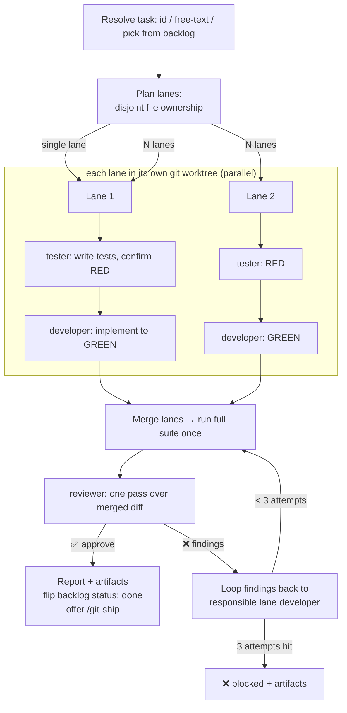

# Feature Pipeline — TDD Orchestrator + Run-Unit-Tests Skill

**Date:** 2026-07-04
**Status:** Approved design, ready for implementation plan
**Plugin:** `workflows`

## Problem & goal

The `workflows` plugin ships three agents — `developer`, `tester`, `reviewer` —
whose prompts repeatedly reference a `feature-pipeline` orchestrator (input
contracts, `run-id`, `.pipeline-artifacts/`, retry loop-back) that **does not
exist yet**. There is no skill that takes a task and drives it through
implement → test → review.

Two gaps to close:

1. **Build the missing orchestrator** as a skill (`/feature-pipeline`).
2. **Make TDD the default.** The current pipeline is test-*after* (developer
   implements, then tester writes tests). TDD requires tests first (RED) then
   implementation (GREEN).

Additional requirement: the orchestrator must run **several developers in
parallel within a single task** when the task is large enough to split.

## Scope

**In scope**

- New skill `feature-pipeline` (orchestrator).
- New skill `run-unit-tests` (stack-agnostic hub for running unit tests + the
  red-green discipline; directly invokable in chat).
- Edits to `tester`, `developer`, and `reviewer` agents to support TDD.
- `evals/` for both new skills, following the repo pattern.
- Post-change `marketplace-sync` (README, `plugin.json`, CLAUDE.md tree).

**Out of scope**

- Cross-task / whole-backlog parallelism (each task is one pipeline run; only
  *intra-task* parallelism is built).
- Auto-push / auto-PR (the pipeline stops at approved review and *offers*
  `/git-ship`; it never pushes on its own).
- Changes to `coding-principles` (the TDD discipline lives in `run-unit-tests`,
  not here).
- Changes to `blueprint` (its `depends_on` / acceptance-criteria output is
  consumed as-is).

## Key decisions

| Decision | Choice | Rationale |
|---|---|---|
| TDD flow | Tester writes tests first & confirms RED → developer implements & drives to GREEN → reviewer. One tester dispatch, one developer dispatch per lane (plus retries). | Reuses the tester's fresh-context spec-isolation (its strongest property) and the developer's existing test-running step. No double-tester. |
| Where run-test knowledge lives | New standalone `run-unit-tests` skill. | User wants it usable without agents too; both developer & tester load it; routes to stack `references/testing.md` so framework specifics aren't duplicated. |
| Parallelism | Intra-task only. Auto-plan disjoint file-ownership sub-parts ("lanes"); fall back to a single lane when it can't split cleanly. | Matches "it knows how to execute" — fully autonomous. Disjoint ownership is what makes parallel developers safe against merge conflicts. |
| Endpoint | Stop at ✅ approved review; report + artifacts; flip backlog `status: done`; **offer** `/git-ship`. | Keeps the risky outward-facing step (push/PR) behind an explicit human go-ahead. |
| Skill name | `feature-pipeline` | Matches the identifier the three agents already reference in their prompts. |
| Retry cap | 3 attempts per lane, then `❌ blocked` with artifacts. | Bounded loop; prevents infinite retry churn. |

## Components

### New skill: `feature-pipeline`

`plugins/workflows/skills/feature-pipeline/SKILL.md`. Slash: `/feature-pipeline`.

Responsibilities:

1. **Resolve the task.**
   - Task **id/name** → read the matching file under `backlog/`, extracting
     acceptance criteria (Given/When/Then), `paths`, and `depends_on`.
   - **Free text** → use it directly as the task.
   - **Nothing** → list the backlog's `todo` tasks and pick / ask.
2. **Plan lanes.** Inspect the task + touched paths. Decide **one lane** (can't
   split cleanly) or **N lanes**, each owning a **non-overlapping** set of
   files, with any shared interfaces/types defined up front. Write `plan.md`.
3. **Run each lane** (concurrently) in its own `git worktree` off an
   integration branch:
   `tester (write tests, confirm RED) → developer (implement, drive to GREEN)`.
4. **Integrate.** Merge lane branches (conflict-free by disjoint-ownership
   construction) → run the **full** suite once → dispatch **one** reviewer pass
   over the merged diff.
5. **Finish.** On ✅: write `pipeline-summary.md`, flip the backlog task
   `status: done` (only when the task came from `backlog/`), report artifact
   paths, and offer `/git-ship`. On failure: retry loop (below) or
   `❌ blocked`.

Uses the agents' existing JSON input/output contracts and re-entry shape
**verbatim** — introduces no new agent protocol.

### New skill: `run-unit-tests`

`plugins/workflows/skills/run-unit-tests/SKILL.md`. Directly invokable
("run the unit tests for this change") and loaded by the developer + tester
agents.

Carries:

- **Runner detection / how to run** at a stack-agnostic level, routing to each
  stack skill's `references/testing.md` for the concrete command, test-scoping,
  and file-naming specifics (no duplication).
- **Red-green discipline:** a RED test must fail *for the right reason*
  (assertion failure, not a compile/collection error); implement the **minimum**
  to reach GREEN; report the **real** run output; **never weaken or delete a
  test to force green**; degrade honestly when no runner exists.

### Agent edits

- **`tester.agent.md`** — add a **spec-first / expect-RED mode**: when
  dispatched before implementation exists, write tests from the acceptance
  criteria, run them, confirm they fail for the right reason, and report RED
  (verdict shape reused). Load `run-unit-tests`.
- **`developer.agent.md`** — add a **TDD / green mode**: load `run-unit-tests`,
  run the pre-written failing tests, implement the minimum to turn them green,
  and report the real run output under Verify. The developer already runs the
  suite in its Verify step; this narrows it to "drive the tester's tests green."
- **`reviewer.agent.md`** — minor: note it reviews the **merged** result of a
  possibly-parallel run. Its existing "weakened/deleted test = 🔴" check already
  guards the main TDD failure mode; keep as-is otherwise.

## Data flow & artifacts

Reuses `.pipeline-artifacts/<run-id>/`, namespaced per lane:

```
.pipeline-artifacts/<run-id>/
├── plan.md                      ← lanes + file ownership
├── lane-01/  change-summary.md  test-report.md
├── lane-02/  change-summary.md  test-report.md
├── review-report.md             ← single review of the merged result
└── pipeline-summary.md          ← final roll-up
```



## Error handling

- **RED not achieved** (a tester test passes with no impl, or fails to compile
  rather than assert): tester reports it; the lane is blocked before reaching
  the developer.
- **Green fails / review finds issues:** loop the specific `test_failures` /
  `review_findings` back to the responsible lane's developer via the existing
  re-entry contract, **max 3 attempts** per lane, then `❌ blocked` for that
  lane with artifacts.
- **Merge conflict** (imperfect ownership plan): serialize the conflicting
  lanes and retry the merge.
- **No test runner in repo:** `run-unit-tests` reports it; the pipeline degrades
  to implement + build-verify + review, and says so explicitly — never fakes
  green.

## Testing / verification

- Each new skill ships `evals/evals.json` + `evals/trigger-eval.json`, following
  the `blueprint` / `git-ship` pattern.
  - `feature-pipeline` trigger evals: fires on "build this task", "run the
    pipeline", "implement F01-T02", "develop and test this feature".
  - `run-unit-tests` trigger evals: fires on "run the unit tests", "run the
    tests for this change".
- After the files land, run `marketplace-sync` to refresh the README plugins/
  skills table, bump `workflows/plugin.json` (version + keywords + description),
  and update the CLAUDE.md structure tree.

## Risks

- **Ownership-plan imperfection** could still cause a merge conflict — mitigated
  by the serialize-and-retry fallback, but a poorly split task degrades to
  slower serial execution. Acceptable.
- **Worktree lifecycle** (create/clean up N worktrees) adds orchestration
  surface; the skill must clean up lane worktrees on both success and failure.
- **TDD honesty** depends on the tester genuinely reaching RED and the developer
  reporting real GREEN output — enforced by the `run-unit-tests` discipline and
  the reviewer's weakened-test check.
