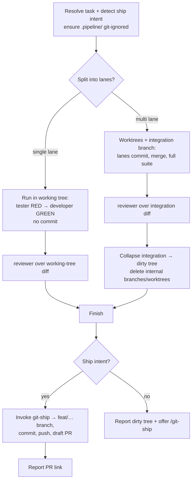

# Feature Pipeline — Git Handoff & Artifacts Fix

**Date:** 2026-07-05
**Status:** Approved design, ready for implementation plan
**Plugin:** `workflows`
**Revises:** `2026-07-04-feature-pipeline-tdd-orchestrator-design.md`

## Problem & goal

Real-world testing of `feature-pipeline` surfaced three defects, two of which
share one root cause:

1. **The pipeline leaves you on a machine-named branch.** It commits each lane
   to a `pipeline/<run-id>/lane-NN` branch and merges into an **integration
   branch** it creates. When it finishes, the approved code sits on that ugly
   branch. If `git-ship` then runs, its Step 2 sees "already on a topic branch →
   stay on it" and pushes the ugly branch instead of minting a clean `feat/…`
   one. The git handoff is broken.
2. **Run artifacts are never reliably committed and the folder name is flat.**
   `.pipeline-artifacts/<run-id>/` is written to disk but not committed (in
   testing it was even `.gitignore`d), and the flat name has no room for
   other pipelines.
3. **`git-ship` is not actually used** to do the git work — the pipeline does
   its own branching.

**Goal:** make the pipeline's git plumbing an invisible internal detail so it
ends with a plain dirty working tree, let `git-ship` own every git-facing step,
and give artifacts a clearer, git-ignored home.

## Scope

**In scope**

- Rework `feature-pipeline`'s git model (§2, §3, §4, §6 of its SKILL.md).
- Add invocation-intent detection to decide offer-vs-auto-ship at the end.
- Rename the artifact folder and ensure it is git-ignored.
- Update the artifact-path references in the `developer`, `tester`, and
  `reviewer` agents.
- Post-change `marketplace-sync` (version bump; description tweak).

**Out of scope**

- Any change to `git-ship` — it already turns a dirty tree on a base branch into
  a `feat/…` branch → commit → push → draft PR, and it respects `.gitignore`.
- Committing artifacts into the repo, or folding a run summary into the PR body
  (explicitly deferred: artifacts stay local scratch "for now").
- Removing intra-task parallel lanes — the multi-lane path stays; only its git
  handoff changes.
- Changes to the TDD RED→GREEN→review flow itself.

## Key decisions

| Decision | Choice | Rationale |
|---|---|---|
| Git plumbing visibility | Internal only. The pipeline never leaves the user on an integration branch; it ends with a dirty working tree on the branch they started on. | The reported bug: a machine-named branch is not a usable handoff. A dirty tree is exactly what `git-ship` consumes. |
| Single lane | **No worktree, no integration branch.** Agents work in the main working tree; nothing is committed. | Worktrees exist only to isolate *parallel* test runs. The common single-lane case needs none of that; running in place removes the branch surprise entirely. |
| Multiple lanes | Keep worktrees + lane branches + integration branch internally, then **collapse** the merged result into uncommitted working-tree changes on the starting branch and delete all internal branches/worktrees. | True parallel test runs still need isolated trees; but the *output* must be the same dirty-tree end state as the single-lane case. |
| Who does git | `git-ship`, always. The pipeline never commits, branches, pushes, or opens a PR. | One owner of git-facing work; the user gets a clean `feat/…` branch and a Conventional-Commit message. |
| Ending | **Honor invocation intent.** Shipping intent present → run `git-ship` (→ draft PR). Absent → report the dirty tree and *offer* `/git-ship`. | User chose "honor how I invoked it": safe by default, autonomous when asked. |
| Artifacts location | Rename `.pipeline-artifacts/<run-id>/` → `.pipeline/feature-pipeline/<run-id>/`. | Nestable under `.pipeline/`; clearer than the flat name. |
| Artifacts in git | **Git-ignored scratch.** The pipeline ensures `.pipeline/` is in `.gitignore` before finishing. | User chose "just git-ignore that for now." Critical because `git-ship` runs `git add -A` — without the ignore, artifacts would be swept into the PR. |

## Components

### `feature-pipeline` SKILL.md — the substantive change

**§1 Resolve the task.** Unchanged, plus: set `run-id` and detect **shipping
intent** in the invocation (see below). Artifacts now write under
`.pipeline/feature-pipeline/<run-id>/`.

**Ensure `.gitignore` covers `.pipeline/`.** Early in the run (before any
artifact is written is fine), check the repo's `.gitignore`; if it doesn't
already ignore `.pipeline/`, append it. This guarantees `git-ship`'s `git add
-A` never commits run artifacts.

**§2 Plan lanes.**
- **Single lane** (the normal case): do **not** create a worktree or integration
  branch. The lane runs in the main working tree on the current branch.
- **Multiple lanes:** create the integration branch and per-lane worktrees
  exactly as today — this is the only path that needs them.

**§3 Run each lane.**
- **Single lane:** tester (RED) → developer (GREEN) write directly in the working
  tree; the developer runs tests there. **No commit** — the work stays as
  uncommitted changes.
- **Multiple lanes:** unchanged — each lane commits on its branch inside its
  worktree so the merge in §4 has committed history to carry.

**§4 Integrate and review.**
- **Single lane:** the reviewer reviews the working-tree diff (`git diff` against
  the branch's HEAD / merge-base). No merge step.
- **Multiple lanes:** merge lane branches into the integration branch and run the
  full suite there, as today. The reviewer reviews the integration diff.

**§6 Finish** (on `✅ approve`):
1. Write `pipeline-summary.md` under the new artifact path.
2. Flip the backlog task `status: done` if it came from `backlog/` (this edits a
   tracked file, so it rides along in the eventual commit — desired).
3. **Collapse to a dirty tree.** *Multiple lanes only:* bring the integration
   result into the starting branch's working tree as uncommitted changes
   (`git restore --source=<integration-branch> --worktree -- .`), then delete the
   integration and lane branches and remove the worktrees. *Single lane:* the
   working tree is already dirty — nothing to collapse. Either way, verify no
   pipeline-created branches or worktrees remain.
4. **Ship or offer, per intent:**
   - **Shipping intent present** → invoke the `git-ship` skill. It creates the
     `feat/…` branch, commits, pushes, opens the draft PR. Report its result
     (branch, commit, PR link).
   - **No shipping intent** → report the approved dirty working tree and offer
     `/git-ship`. Do not run it.

**Shipping-intent signals.** The invocation expresses intent to ship when it
contains a ship phrase — "and open a PR", "open a pr", "ship it", "ship this",
"and push", "raise an MR/PR" — or an explicit `--ship` flag. Absent any such
signal, default to offer-only.

**Worktree lifecycle.** Unchanged in spirit: every worktree/branch the pipeline
creates (multi-lane only) must be removed on every exit path — success, blocked,
or error. Single-lane runs create none, so there is nothing to clean up.

### Agent edits — artifact path only

`developer.agent.md`, `tester.agent.md`, `reviewer.agent.md` reference the
artifact directory `.pipeline-artifacts/<run-id>/`. Update each reference to
`.pipeline/feature-pipeline/<run-id>/`. No behavioral change.

### Housekeeping

- Update the `feature-pipeline` frontmatter description: it offers to ship by
  default and auto-ships when the invocation asks for it.
- Run `marketplace-sync` (bump `workflows/plugin.json` version; refresh README /
  CLAUDE.md if wording changed).

## Data flow & artifacts

```
.pipeline/feature-pipeline/<run-id>/     ← git-ignored
├── plan.md                      ← lanes + file ownership (multi-lane) or single-lane note
├── lane-01/  change-summary.md  test-report.md
├── lane-02/  change-summary.md  test-report.md   (multi-lane only)
├── review-report.md
└── pipeline-summary.md
```



## Error handling

- **`.gitignore` write fails / no `.gitignore`:** create the file with a
  `.pipeline/` entry; if the repo is not a git repo, the pipeline was already in
  an invalid state (nothing to ship) — report and stop.
- **Collapse conflict (multi-lane):** `git restore --source=<integration>`
  overwrites the working tree from the integration result; because the starting
  branch didn't move during the run, there is nothing to conflict with. If the
  working tree had unrelated uncommitted edits at the start, warn before
  overwriting.
- **`git-ship` stops (e.g. base moved with conflicts):** the pipeline surfaces
  git-ship's report as-is; the change is safe in the working tree regardless.
- **Retry cap, blocked lanes, no runner:** unchanged from the original design.

## Testing / verification

- Update `feature-pipeline` trigger evals to include a shipping-intent phrase
  (e.g. "build F01-T02 and open a PR" → triggers; still ends in git-ship) and a
  no-intent phrase (offer only). Existing behavior evals stay; add one asserting
  the run ends with a dirty working tree and **no** pipeline-created branch.
- After the files land, run `marketplace-sync`.

## Risks

- **Collapse step (multi-lane) is the one delicate git operation.** Mitigated by
  the invariant that the starting branch never moves during the run, so the
  restore is a clean overwrite, not a merge. Single-lane (the common path) avoids
  it entirely.
- **Intent detection is heuristic.** A missed ship phrase just falls back to the
  safe offer-only path; a false positive would run `git-ship`, which itself only
  opens a *draft* PR. Low blast radius either way.
