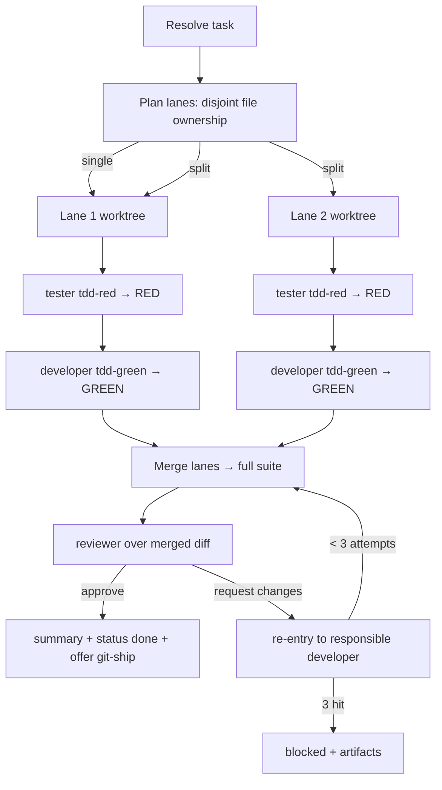

# Feature Pipeline

Take **one task** and drive it — test-first — through implement → test → review,
using the `developer`, `tester`, and `reviewer` agents. You are the orchestrator
those agents already reference: you set the `run-id`, dispatch each agent with
its JSON contract, route failures back, and persist artifacts under
`.pipeline-artifacts/<run-id>/`.

**Default is TDD.** Tests are written and confirmed RED *before* any
implementation, then driven GREEN, then reviewed. This is not a mode — it is how
the pipeline runs.

## When to use

- The user hands a backlog task id (`F01-T02`), a free-text feature, or asks to
  "build / implement / develop this task".
- An agent or the main thread needs one task taken from spec to reviewed change.

**Not for:** decomposing requirements into a backlog (that's `blueprint`
upstream) or pushing/opening a PR (that's `git-ship`, which this skill *offers*
at the end but never runs unprompted).

## 1. Resolve the task

- **Task id / name given** → read the matching file under `backlog/` (e.g.
  `backlog/features/*/tasks/*F01-T02*.md`). Extract its Given/When/Then
  acceptance criteria, `paths`, and `depends_on`. If `depends_on` names a task
  whose `status` isn't `done`, warn and confirm before proceeding.
- **Free text given** → use it directly as the task; there are no criteria to
  read, so the tester derives them from the description.
- **Nothing given** → list the backlog's `todo` tasks and ask which to build
  (or pick the highest-priority unblocked one if told to proceed).

Set a `run-id` (`YYYY-MM-DD-HHMM`). Everything below writes under
`.pipeline-artifacts/<run-id>/`.

## 2. Plan lanes (intra-task parallelism)

Decide whether the task splits into independent parallel **lanes**:

- Inspect the task and its `paths`. A lane owns a **non-overlapping** set of
  files. Two lanes must never be able to edit the same file — that is the whole
  guarantee against merge conflicts.
- If the work naturally divides into disjoint file sets (e.g.
  `src/auth/login/*`, `src/auth/session/*`, `src/auth/reset/*`), define one lane
  per set. Define any **shared** interfaces/types they all depend on **up
  front**, in the plan, so no lane invents a conflicting version.
- If it can't be cleanly split (everything touches one file, or the boundaries
  are unclear), use **one lane**. A single lane is the normal case — don't force
  a split.

Write the plan to `.pipeline-artifacts/<run-id>/plan.md`: the lanes, each lane's
owned paths, and the shared interfaces. Create an **integration branch** off the
current branch, and one **git worktree per lane** branched off it:

```bash
git worktree add -b pipeline/<run-id>/lane-01 ../wt-<run-id>-lane-01 <integration-branch>
```

## 3. Run each lane — test-first (RED → GREEN)

Run lanes **concurrently** (dispatch the parallel agents together). Each lane, in
its own worktree, runs two dispatches:

1. **Tester (RED).** Dispatch the `tester` agent with `mode: "tdd-red"`, the
   task, the lane's acceptance criteria, and the `run-id`. Expect verdict
   `🔴 red-confirmed`. If the tester returns `⚠️ blocked` (can't reach a valid
   RED), the lane is blocked before the developer — record it and stop that lane.
2. **Developer (GREEN).** Dispatch the `developer` agent with `mode:
   "tdd-green"`, the task, the lane's owned `paths`, `failing_tests` from the
   tester, and the `run-id`. Expect the tests driven to real GREEN.

Each dispatch writes its artifact under `.pipeline-artifacts/<run-id>/lane-NN/`
(`test-report.md`, `change-summary.md`) — the agents already do this when given
a `run-id`; pass a lane-scoped `run-id` (`<run-id>/lane-NN`) so they don't
collide.

## 4. Integrate and review

Once every lane is GREEN:

1. **Merge** each lane branch into the integration branch. Because lanes own
   disjoint files, merges are conflict-free by construction. If a merge *does*
   conflict, the ownership plan was imperfect — serialize the conflicting lanes
   (re-run one on top of the other's result) rather than force-resolving.
2. **Full suite.** On the integration branch, load `run-unit-tests` and run the
   **full** test suite once. A failure here (a cross-lane interaction the
   per-lane runs missed) routes back as a developer retry (§5).
3. **Review.** Compute the merged diff (`git diff <base>...<integration-branch>`)
   and dispatch the `reviewer` agent with the task, the roll-up change summary,
   the test reports, the diff, and the `run-id`. It writes
   `.pipeline-artifacts/<run-id>/review-report.md`.

## 5. Retry loop

On a red review (`❌ request changes`) or a failing full suite:

- Route each `review_finding` / `test_failure` back to the **responsible lane's**
  developer using that agent's existing **re-entry contract** (`attempt`,
  `previous_summary`, `test_failures`, `review_findings`) — it fixes the specific
  failures rather than re-implementing.
- Re-run that lane's tests to green, re-merge, re-run the full suite, and
  re-review (the reviewer checks each prior finding, then sweeps for
  regressions).
- **Cap: 3 attempts per lane.** After the third, stop that lane and report
  `❌ blocked` with the artifacts so the human can take over.

## 6. Finish

On `✅ approve`:

1. Write `.pipeline-artifacts/<run-id>/pipeline-summary.md`: the task, the lanes
   and their files, test counts, the review verdict, and the artifact paths.
2. If the task came from `backlog/`, flip its frontmatter `status` to `done`
   (leave a free-text task alone — there's no backlog file to update).
3. Clean up: remove the lane worktrees (`git worktree remove …`) on both success
   and failure — never leave orphaned worktrees.
4. **Offer to ship** — do not push. Tell the user the change is approved on the
   integration branch and offer `/git-ship` to branch/commit/push/PR. Ship only
   if they say so.

## Worktree lifecycle (must clean up)

Every worktree you create in §2 must be removed in §6, on **every** exit path —
success, blocked, or error. Orphaned worktrees and `pipeline/<run-id>/lane-NN`
branches are litter. If a run aborts mid-flight, remove the worktrees you created
before reporting.

## Report

End with a short, actionable summary:

- the task (id or description) and the `run-id`;
- lanes run (parallel or single) and the files each produced;
- test result (RED confirmed → GREEN counts) and the review verdict;
- artifact paths under `.pipeline-artifacts/<run-id>/`;
- the offer to `/git-ship`.

## Flow



## Edge cases

- **`depends_on` not done:** warn; don't silently build on unshipped work.
- **Free-text task, no criteria:** the tester derives scenarios from the
  description — expect a broader RED; note the derivation in the summary.
- **Can't split cleanly:** one lane. Never split just to parallelize.
- **A lane's tester can't reach a valid RED:** that lane is blocked before the
  developer; report it rather than implementing blind.
- **Repo has no runner:** the pipeline degrades to implement + build-verify +
  review (no GREEN gate) and says so — never fakes a green run.
