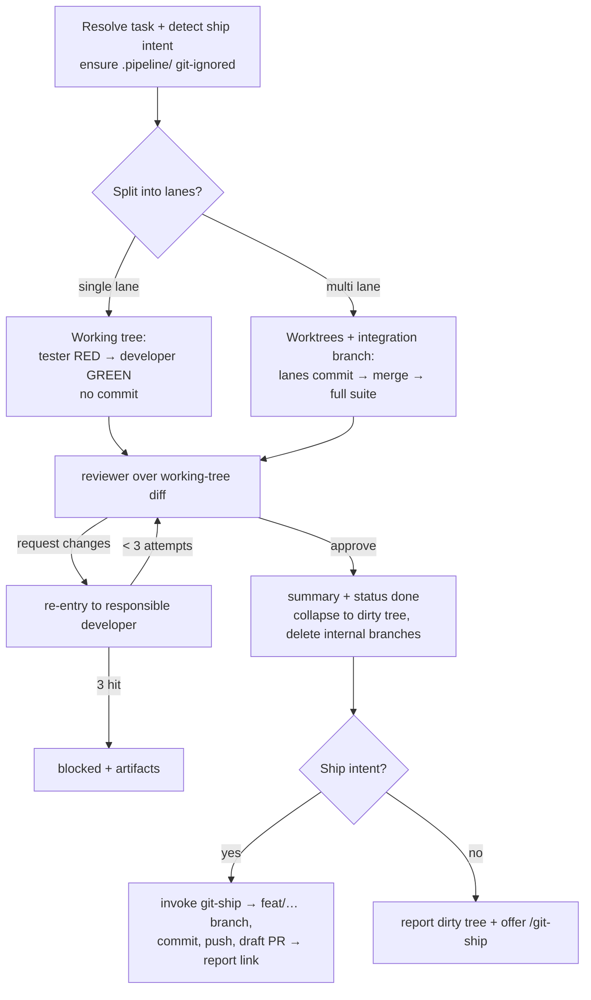

# Feature Pipeline

Take **one task** and drive it — test-first — through implement → test → review,
using the `developer`, `tester`, and `reviewer` agents. You are the orchestrator
those agents already reference: you set the `run-id`, dispatch each agent with
its JSON contract, route failures back, and persist artifacts under
`.pipeline/feature-pipeline/<run-id>/`.

**Default is TDD.** Tests are written and confirmed RED *before* any
implementation, then driven GREEN, then reviewed. This is not a mode — it is how
the pipeline runs.

**You never touch git-facing state.** You do not commit, branch, push, or open a
PR. Your job ends with the approved change sitting as **uncommitted edits in the
working tree** on the branch the user started on. All branching, committing,
pushing, and PR work belongs to `git-ship`, which you either offer or invoke
(§6). Any git branches/worktrees you create for parallel lanes are internal
plumbing, torn down before you finish.

## When to use

- The user hands a backlog task id (`F01-T02`), a free-text feature, or asks to
  "build / implement / develop this task".
- An agent or the main thread needs one task taken from spec to reviewed change.

**Not for:** decomposing requirements into a backlog (that's `blueprint`
upstream). Shipping *is* part of this pipeline now — it hands off to `git-ship`
at the end (§6) rather than excluding it.

## 1. Resolve the task

- **Task id / name given** → read the matching file under `backlog/` (e.g.
  `backlog/features/*/tasks/*F01-T02*.md`). Extract its Given/When/Then
  acceptance criteria, `paths`, and `depends_on`. If `depends_on` names a task
  whose `status` isn't `done`, warn and confirm before proceeding.
- **Free text given** → use it directly as the task; there are no criteria to
  read, so the tester derives them from the description.
- **Nothing given** → list the backlog's `todo` tasks and ask which to build
  (or pick the highest-priority unblocked one if told to proceed).

Set a `run-id` (`YYYY-MM-DD-HHMM`). Everything below writes under
`.pipeline/feature-pipeline/<run-id>/`.

**Detect shipping intent.** Note whether the invocation asks to ship — it
contains a ship phrase ("and open a PR", "open a pr", "ship it", "ship this",
"and push", "raise an MR", "raise a PR") or an explicit `--ship` flag. Record
this now; §6 uses it to decide whether to *run* `git-ship` or merely *offer* it.
Absent any such signal, the default is offer-only.

**Ensure artifacts are git-ignored.** Before writing any artifact, make sure the
repo ignores the artifact tree — otherwise `git-ship`'s `git add -A` would sweep
it into the commit. If the repo-root `.gitignore` has no line matching
`.pipeline/`, append `.pipeline/` to it; if there is no `.gitignore`, create one
containing `.pipeline/`.

```bash
grep -qxF '.pipeline/' .gitignore 2>/dev/null || printf '.pipeline/\n' >> .gitignore
```

## 2. Plan lanes (intra-task parallelism)

Decide whether the task splits into independent parallel **lanes**:

- Inspect the task and its `paths`. A lane owns a **non-overlapping** set of
  files. Two lanes must never be able to edit the same file — that is the whole
  guarantee against merge conflicts.
- **Single lane — the normal case.** If the work can't be cleanly split
  (everything touches one file, or the boundaries are unclear), use **one lane**,
  and do **not** create a worktree or integration branch. The tester and
  developer work directly in the current working tree on the current branch.
  Write the plan note to `.pipeline/feature-pipeline/<run-id>/plan.md` (task,
  single lane, owned paths). Don't force a split just to parallelize.
- **Multiple lanes.** Only when the work naturally divides into disjoint file
  sets (e.g. `src/auth/login/*`, `src/auth/session/*`, `src/auth/reset/*`),
  define one lane per set, and define any **shared** interfaces/types they all
  depend on **up front**, in the plan, so no lane invents a conflicting version.
  Write `plan.md` with the lanes, each lane's owned paths, and the shared
  interfaces. Create an **integration branch** off the current branch, and one
  **git worktree per lane** branched off it:

  ```bash
  git worktree add -b pipeline/<run-id>/lane-01 ../wt-<run-id>-lane-01 <integration-branch>
  ```

## 3. Run each lane — test-first (RED → GREEN)

**Single lane.** In the current working tree, run two dispatches:

1. **Tester (RED).** Dispatch the `tester` agent with `mode: "tdd-red"`, the
   task, the acceptance criteria, and the `run-id`. Expect verdict
   `🔴 red-confirmed`. If the tester returns `⚠️ blocked` (can't reach a valid
   RED), stop — report it and don't implement blind.
2. **Developer (GREEN).** Dispatch the `developer` agent with `mode:
   "tdd-green"`, the task, the lane's owned `paths`, `failing_tests` from the
   tester, and the `run-id`. Expect the tests driven to real GREEN.

Do **not** commit. The tester and developer only write files; the change stays
uncommitted in the working tree — exactly the state §6 hands to `git-ship`.

**Multiple lanes.** Run lanes **concurrently** (dispatch the parallel agents
together). Each lane, in its own worktree, runs three steps:

1. **Tester (RED)** and **2. Developer (GREEN)** as above, but pass a
   lane-scoped `run-id` (`<run-id>/lane-NN`) so the agents' artifacts don't
   collide.
3. **Commit the lane.** Once the developer reports GREEN, commit the lane's code
   and tests on its branch from inside the worktree
   (`git -C <lane-worktree> add -A && git -C <lane-worktree> commit -m
   "feat: <task> (lane NN)"`). This is mandatory: the developer and tester only
   *write* files, so their work sits uncommitted inside the isolated worktree,
   and `git merge` in §4 carries only committed history. Then copy the lane's
   `.pipeline/feature-pipeline/<run-id>/lane-NN/` directory from the worktree
   back into the main repo so the consolidated artifact tree survives worktree
   cleanup.

Each agent dispatch writes its artifact (`test-report.md`, `change-summary.md`)
under `.pipeline/feature-pipeline/<run-id>/` (single lane) or
`.pipeline/feature-pipeline/<run-id>/lane-NN/` (multi lane) — the agents already
do this when given a `run-id`.

## 4. Integrate and review

**Single lane.** There is no merge. Stage the change so the diff includes new
files, and hand the reviewer that diff:

```bash
git add -A                                  # safe: .pipeline/ is git-ignored (§1)
git diff --cached > .pipeline/feature-pipeline/<run-id>/merged.diff
```

Dispatch the `reviewer` agent with the task, the developer's change summary, the
test report, the diff file, and the `run-id`. It writes
`.pipeline/feature-pipeline/<run-id>/review-report.md`. (Staging is harmless and
reversible — `git-ship` re-runs `git add -A` in §6.)

**Multiple lanes.** Once every lane is GREEN:

1. **Merge** each lane branch — now carrying its committed code and tests (§3) —
   into the integration branch. Because lanes own disjoint files, merges are
   conflict-free by construction. If a merge *does* conflict, the ownership plan
   was imperfect — serialize the conflicting lanes (re-run one on top of the
   other's result) rather than force-resolving.
2. **Full suite.** On the integration branch, load `run-unit-tests` and run the
   **full** test suite once. A failure here (a cross-lane interaction the
   per-lane runs missed) routes back as a developer retry (§5).
3. **Review.** Compute the merged diff
   (`git diff <base>...<integration-branch> > .pipeline/feature-pipeline/<run-id>/merged.diff`)
   and dispatch the `reviewer` agent with the task, the roll-up change summary,
   the test reports, the diff file, and the `run-id`. It writes
   `.pipeline/feature-pipeline/<run-id>/review-report.md`.

## 5. Retry loop

On a red review (`❌ request changes`) or a failing full suite:

- Route each `review_finding` / `test_failure` back to the **responsible lane's**
  developer using that agent's existing **re-entry contract** (`attempt`,
  `previous_summary`, `test_failures`, `review_findings`) — it fixes the specific
  failures rather than re-implementing.
- Re-run that lane's tests to green, re-merge (multi lane), re-run the full suite
  (multi lane), and re-review (the reviewer checks each prior finding, then
  sweeps for regressions).
- **Cap: 3 attempts per lane.** After the third, stop that lane and report
  `❌ blocked` with the artifacts so the human can take over.

## 6. Finish

On `✅ approve`:

1. Write `.pipeline/feature-pipeline/<run-id>/pipeline-summary.md`: the task, the
   lanes and their files, test counts, the review verdict, and the artifact
   paths.
2. If the task came from `backlog/`, flip its frontmatter `status` to `done`
   (this edits a tracked file, so it rides along in the eventual commit —
   desired). Leave a free-text task alone.
3. **Land the change as a dirty working tree.**
   - **Single lane:** the working tree already holds the uncommitted change —
     nothing to collapse.
   - **Multiple lanes:** from the main repo, still on the user's starting branch,
     bring the integration result into the working tree as uncommitted changes,
     then tear down all internal branches and worktrees:
     ```bash
     git restore --source=<integration-branch> --worktree -- .
     git worktree remove ../wt-<run-id>-lane-01        # repeat per lane
     git branch -D pipeline/<run-id>/lane-01           # repeat per lane
     git branch -D <integration-branch>
     ```
   Because the starting branch never moved during the run, the restore is a clean
   overwrite, not a merge. Confirm nothing internal remains:
   ```bash
   git worktree list ; git branch --list 'pipeline/<run-id>/*'
   ```
   (both should show no pipeline-created entries).
4. **Ship or offer — per the intent recorded in §1:**
   - **Shipping intent present** → invoke the `git-ship` skill. It reads the
     dirty tree, picks the Conventional-Commit message, creates the `feat/…`
     branch, commits, pushes, and opens the draft PR. Report its branch, commit,
     and PR link.
   - **No shipping intent** → report that the approved change sits uncommitted on
     the current branch and **offer** `/git-ship` to branch/commit/push/PR. Do
     not run it.

## Worktree lifecycle (multi-lane only)

Single-lane runs create no worktree or branch — there is nothing to clean up.
Multi-lane runs must remove every worktree and delete every
`pipeline/<run-id>/lane-NN` and the integration branch they created, on **every**
exit path — success, blocked, or error. The collapse + teardown in §6 step 3 is
that cleanup on the success path; on an aborted or blocked run, remove the
worktrees and delete the branches you created before reporting. Never remove a
lane's worktree until its §3 commit and artifact copy-back have run — removing
first discards the only copy of the lane's work.

## Report

End with a short, actionable summary:

- the task (id or description) and the `run-id`;
- lanes run (parallel or single) and the files each produced;
- test result (RED confirmed → GREEN counts) and the review verdict;
- artifact paths under `.pipeline/feature-pipeline/<run-id>/`;
- **either** the `git-ship` result (branch + PR link) when shipped, **or** the
  offer to `/git-ship` and a note that the change is uncommitted on the current
  branch.

## Flow



## Edge cases

- **`depends_on` not done:** warn; don't silently build on unshipped work.
- **Free-text task, no criteria:** the tester derives scenarios from the
  description — expect a broader RED; note the derivation in the summary.
- **Can't split cleanly:** one lane, in place. Never split just to parallelize.
- **A lane's tester can't reach a valid RED:** that lane is blocked before the
  developer; report it rather than implementing blind.
- **Repo has no runner:** the pipeline degrades to implement + build-verify +
  review (no GREEN gate) and says so — never fakes a green run.
- **Unrelated uncommitted edits at start (multi lane):** the §6 collapse
  overwrites paths from the integration result; if the starting tree already had
  unrelated uncommitted changes, warn before overwriting.
- **Not a git repo:** there is nothing to ship and no `.gitignore` to guarantee —
  report and stop rather than proceeding.
